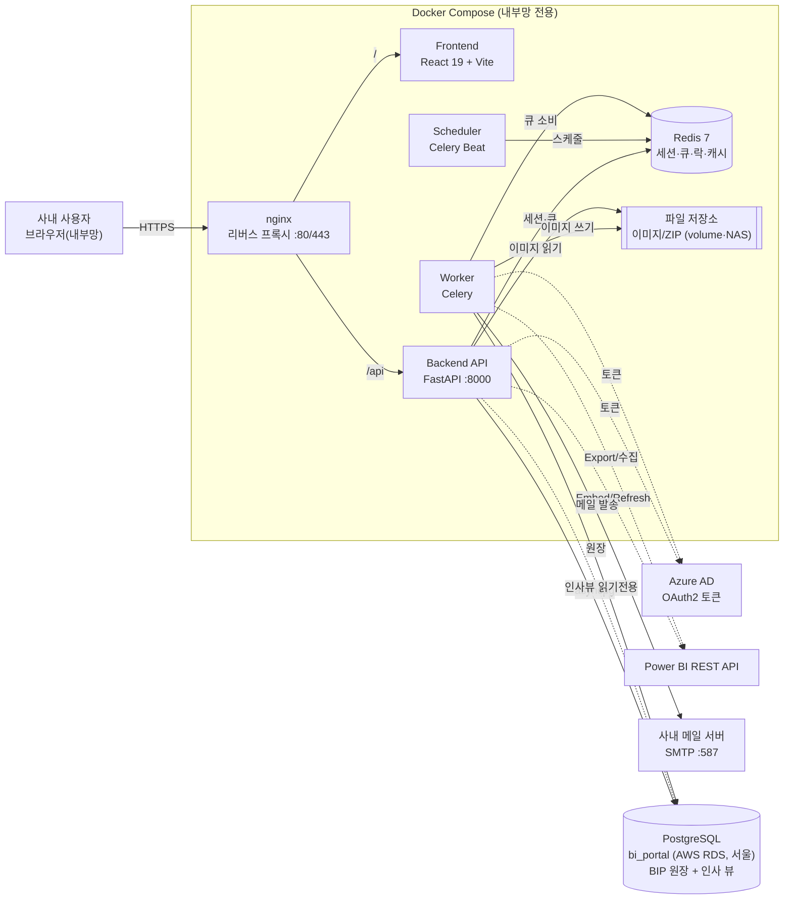
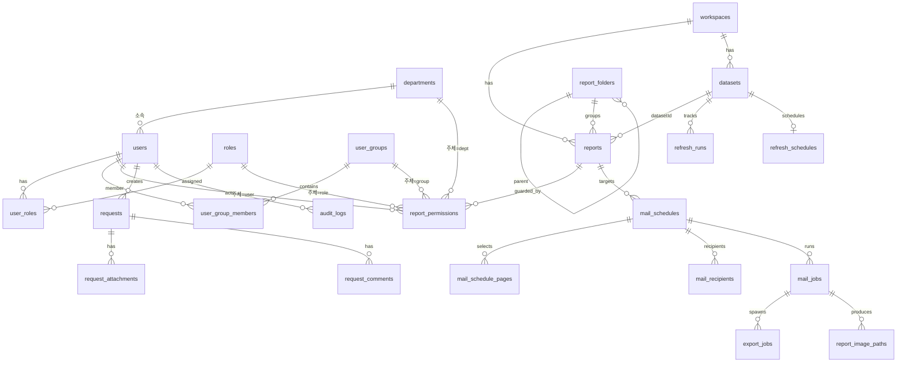

# BI Portal(BIP) 1차 구현 보고

- 대상: 팀장 보고용 요약
- 작성 기준: 2026-07 개발 현황 반영
- 목적: 기존 외부 업체 Power BI 공유 포털을 **자체 개발 시스템(BIP)**으로 대체
- 상세 근거: `requirements.md`(요구 R), `design.md`(설계), `risk & decision_log.md`(결정 D / 리스크 RK), `tasks.md`·`wbs.md`(작업)

---

## 1. 1차(v1.0) 구현 대상 범위표

### 1.1 v1.0 포함 범위 (기능 영역별)

| # | 기능 영역 | 주요 내용 | 상태 |
|---|---|---|---|
| 1 | 프로젝트 기반/인프라 | 저장소·Backend(FastAPI)·Frontend(React19) 골격, 외부 RDS 연결, 로컬 실행/워커(dev-up·worker·beat·redis) | 완료 |
| 2 | 데이터 모델·마이그레이션 | 전체 원장 테이블 + Alembic(단일 `bip` 스키마), CI 무결성 검증 | 완료 |
| 3 | 인증/세션 | 인사정보 DB 사번/비밀번호(SHA-256³) 로그인, 비상 로컬 관리자, Redis 세션(idle 2h + absolute 12h) | 완료 |
| 4 | 사용자/그룹/역할/권한 | 4종 주체(사용자·역할·부서·그룹) 합집합 권한, 조직도 기반 팀 그룹 자동 생성·동기화 | 완료 |
| 5 | 레포트 카탈로그/폴더 | PBIX 업로드 게시(일원화), 폴더 트리 분류, 사이드바 탐색기·즐겨찾기 | 완료 |
| 6 | Power BI Embedded 조회/새로고침 | App-Owns-Data 임베드, 새로고침 상태·갱신 예정, 수동 새로고침, Refresh 실행 현황(Gantt) | 완료 |
| 7 | Export/정기 메일 발송 | Export→이미지→메일 파이프라인, 스케줄 CRUD(수신자·페이지·발신자), 리치 본문 | 완료 |
| 8 | 감사/통계/모니터링 | 감사 로그, 통계 대시보드(기간 필터), 시스템 상태(health/status) | 완료 |
| 9 | 서비스 센터(R17) | 문의/에러/개선요청, 상태 관리, 첨부·댓글·알림 메일, 완료 예정일 | 완료 |
| 10 | 프런트 공통 | 로그인 화면, 관리자 콘솔/앱 레이아웃, 한국어화/오류 처리 | 완료 |
| 11 | 공휴일/보존/배포 | 공휴일 발송 제외, 보존 정리 작업, nginx 프록시·TLS | 완료 |
| 12 | 테스트/릴리스 게이트 | 핵심 속성기반테스트(권한/토큰/락/멱등/시간), 통합·보안·성능 검증 | 완료 |
| — | 운영 이관 준비 | 개발계→운영계 체크리스트, `.env.prod`, Embedded 서버 이전 | **예정(잔여)** |

> 상태 요약: **기능 개발 12개 영역 완료.** 남은 것은 운영 이관 준비(11.4)뿐. (근거: `wbs.md`)

### 1.2 v1.0 제외 / 후속(v1.1+·v1.2) 범위

| 항목 | 범위 | 사유 |
|---|---|---|
| 겸직 다중 부서(Job_Context) 선택 | v1.1+ | v1.0은 기본 부서 단일로 충분 |
| 전체 PRM 대시보드 통합 | v1.1+ | 핵심 조회/운영 우선 |
| AI 분석 | v1.1+ | 후속 고도화 |
| PBIX 완전 셀프 업로드/자동 검수 | v1.1+ | v1.0은 관리자 업로드 |
| 사용자별 RLS(행 수준 보안) | v1.1+/PoC | 레포트 단위 권한으로 대체 |
| Embedded 용량 자동 스케일 | v1.2 | v1.0 수동 운영(D-21) |
| 서비스센터 고도화(카테고리/메신저 알림/영업시간 SLA/첨부 스캔) | v1.1+ | 핵심 기능 우선 |

---

## 2. 주요 의사결정 / 리스크 목록

### 2.1 주요 의사결정 (Decision Log, D-01~D-25 요약)

| ID | 주제 | 결정(v1.0) | 범위 |
|---|---|---|---|
| D-01 | 인증 방식(SSO 부재) | 인사정보 DB(`scl_v_insa_*`) 사번/SHA-256³ 로그인, 읽기 전용 | v1.0 |
| D-02 | 세션 저장 | 쿠키 토큰 + Redis 세션(즉시 무효화 가능). idle 2h + absolute 12h | v1.0 |
| D-03 | Refresh 표시 | DB 동기화 + 강제 동기화 하이브리드 | v1.0 |
| D-04 | 운영 DB | 외부 `bi_portal`(AWS RDS, 서울), SSL 필수 | v1.0 |
| D-05 | 권한 모델 | 4종 주체 단일 `report_permissions` 테이블 합집합 | v1.0 |
| D-06 | Embed 발급 | App-Owns-Data(단일 서비스 계정), RLS는 v1.1+ | v1.0 |
| D-07 | Worker/큐 | Celery + Celery Beat(PRM 재활용) | v1.0 |
| D-09 | 파일 저장 | StorageService 추상화(개발 volume→운영 NAS), DB엔 메타만 | v1.0 |
| D-10 | 분산 락 | `bip:lock:{job}:{key}` + 작업별 TTL(멱등 재진입) | v1.0 |
| D-11 | 비밀번호 해시(로컬 관리자) | argon2id | v1.0 |
| D-12 | 메일 발송 | Worker 비동기 + 재시도, 미인증 SMTP(:587, 옵션 env로 확장) | v1.0 |
| D-15 | 레포트 게시 | PBIX Import 업로드로 **일원화**(기존 레포트 게시 제거) | v1.0 |
| D-17 | DB 스키마 | BIP 전용 `bip` 스키마(인사 뷰와 분리) | v1.0 |
| D-18 | CSRF/CORS | SameSite 쿠키 + CSRF 토큰 + CORS allowlist | v1.0 |
| D-22 | Embedded 서버 이전 | Power BI 연결정보 전부 env 외부화 → `.env` 교체로 전환 | v1.0 |
| D-23 | 개발↔운영 이관 | Alembic 단일 소스로 스키마 재현, 환경차는 `.env`만 | v1.0 |
| D-24 | 역할→메뉴 접근 | 편집형 매트릭스 제거 → 코드 고정 매핑 | v1.0 |
| D-25 | 팀 권한 그룹 | 조직도 기반 팀 그룹 자동 생성/완전 동기화(미리보기→적용) | v1.0 |
| D-21 | Embedded 용량 자동 스케일 | **연기(v1.2)** — v1.0은 수동 운영 | v1.2 |

> 전체 결정은 대안 비교·되돌리기 난이도와 함께 `risk & decision_log.md`에 D-01~D-25로 정리.

### 2.2 리스크 등록부 (Risk Register, 주요 항목)

| ID | 리스크 | 영향 | 대응 |
|---|---|---|---|
| RK-04 | Embed master token/secret 유출 | 매우 높음 | 서버 보관·단기 토큰만 전달·로그 마스킹 |
| RK-05 | 권한 합집합 계산 오류로 무단 노출 | 매우 높음 | 속성기반테스트 + Backend 재검증 |
| RK-03 | 메일 중복/누락 발송 | 높음 | Redis 락 + `mail_jobs` UNIQUE(run_key) 멱등 |
| RK-10 | 1인·단기 일정 초과 | 높음 | v1.0 우선, PRM 자산 재활용, v1.1+ 분리 |
| RK-13 | A1(3GB) 메모리 한계로 새로고침 실패 | 중 | A2 스케일 업(시간대/상시), 모델 경량화 검토 |
| RK-02 | Power BI rate limit(429) | 중 | backoff + DB 동기화로 호출 최소화 |
| RK-06 | 외부 RDS 연결 단절 | 높음 | 풀 재시도, 모니터링 노출, 원장-Redis 분리 |
| RK-14 | Embedded 서버 이전 시 ID 매핑 단절 | 중 | 연결정보 env 외부화, 신규 ID 재등록, 테스트 후 cutover |
| RK-15 | 해시 인코딩 불일치 로그인 실패 | 높음 | SHA-256³ 실측 확정, 인증 모듈 격리 |
| RK-07 | 이미지 파일 누적 디스크 고갈 | 중 | 보존/정리 주기 작업 |

> 전체 18개(RK-01~RK-18)는 `risk & decision_log.md` 참조.

### 2.3 확정 완료 / 잔여 확인

- **확정 완료**: 인증 방식, Embed 발급, 파일 저장, PBIX 업로드, SMTP, 운영 DB(RDS), Power BI 용량 방침.
- **잔여 확인(경미)**: 인사 비밀번호 해시의 라운드 간 입력 형태(hex vs bytes) — 알려진 샘플 1건으로 최종 검증(로그인은 현재 정상 동작). 운영계 호스트/워크스페이스 값(`.env.prod`) 확정.

---

## 3. 시스템 구성도 · ERD

### 3.1 시스템 구성도 (배포/런타임)

핵심 경계
- **DB**: 외부 AWS RDS PostgreSQL `bi_portal`(서울, SSL 필수). BIP 테이블은 전용 `bip` 스키마, 인사 뷰(`public.scl_v_insa_*`)는 읽기 전용 참조.
- **Redis**: 세션·큐·분산락·토큰 캐시 전용(원장 저장 금지, 휘발성 허용).
- **시크릿 경계**: Power BI/Azure/SMTP 시크릿은 backend/worker/scheduler에만 주입, 프런트 빌드에 미포함.
- **장기 작업**: Export·Refresh·메일·수집은 Worker(Celery)로 위임, 분산 락으로 중복 방지.
- 기술 스택: FastAPI · React 19/Vite/TS/Tailwind · Celery + Beat · Redis 7 · PostgreSQL 16 · nginx.

### 3.2 ERD (데이터 모델 관계도)

도메인: **auth**(사용자·역할·부서·로컬관리자) · **portal**(그룹) · **report**(레포트·폴더·권한) · **job**(새로고침·메일·Export·이미지) · **log**(감사) · **system**(서비스센터).

주요 엔터티(핵심 컬럼)
- `users`(사번=`external_id` UNIQUE, `department_id`, `is_active`) · `roles`(General/Super/Operator) · `departments`(`external_id`=dept_id)
- `user_groups`(`source_dept_id`=조직도 자동관리 식별) · `user_group_members`
- `reports`(`workspace_id`·`report_id`·`dataset_id`·`folder_id`·`is_published`·`default_view_state`) · `report_folders`(자기참조 트리) · `datasets` · `workspaces`
- `report_permissions`(`subject_type`=user/role/dept/group, `permission`=VIEW/DOWNLOAD/REFRESH/MANAGE_REPORT/VIEW_STATS, UNIQUE)
- `refresh_runs`(UTC/Local 이중 시간) · `refresh_schedules`
- `mail_schedules`(수신자·페이지 다중, `sender_email`) · `mail_jobs`(UNIQUE run_key 멱등) · `export_jobs` · `report_image_paths`
- `requests`(문의/에러/개선, 상태·완료예정일) · `request_attachments` · `request_comments` · `audit_logs`

> 인사 뷰(`public.scl_v_insa_*`)는 BIP 소유가 아니므로 ERD에 미포함(읽기 전용 참조). 전체 컬럼 정의는 `design.md` "Data Models"(ERD) 참조.

---

## 요약 (한 줄)

v1.0 기능 개발(인증·권한·레포트 조회·새로고침·정기 메일·서비스센터·통계·감사) **완료**, 남은 작업은 **운영계 이관 준비**뿐이며, 주요 기술 결정(D-01~D-25)과 리스크(RK-01~RK-18)는 문서로 추적 관리 중.
