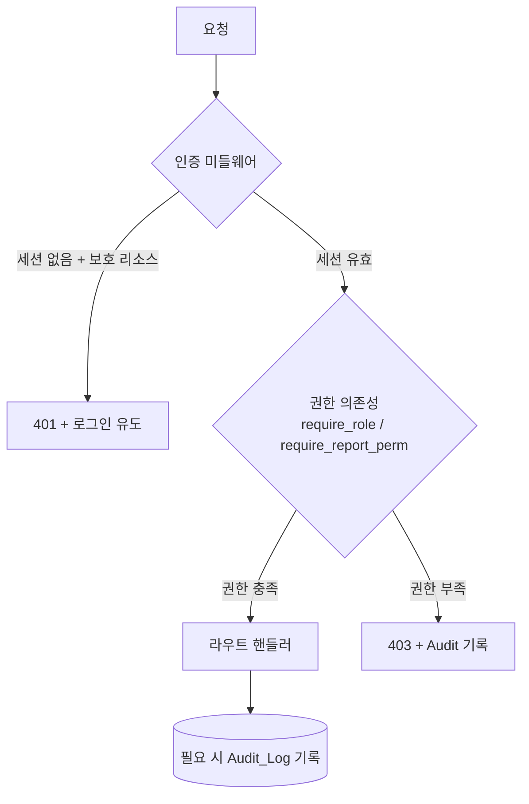
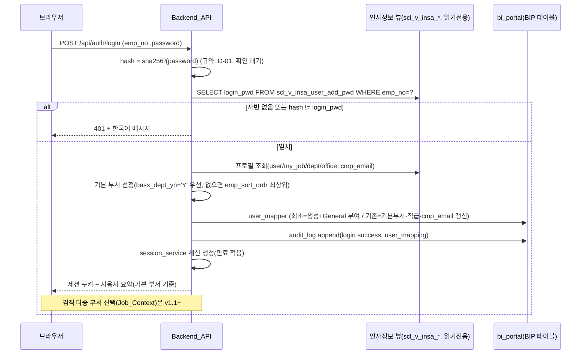
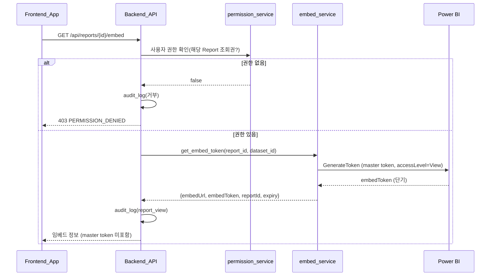
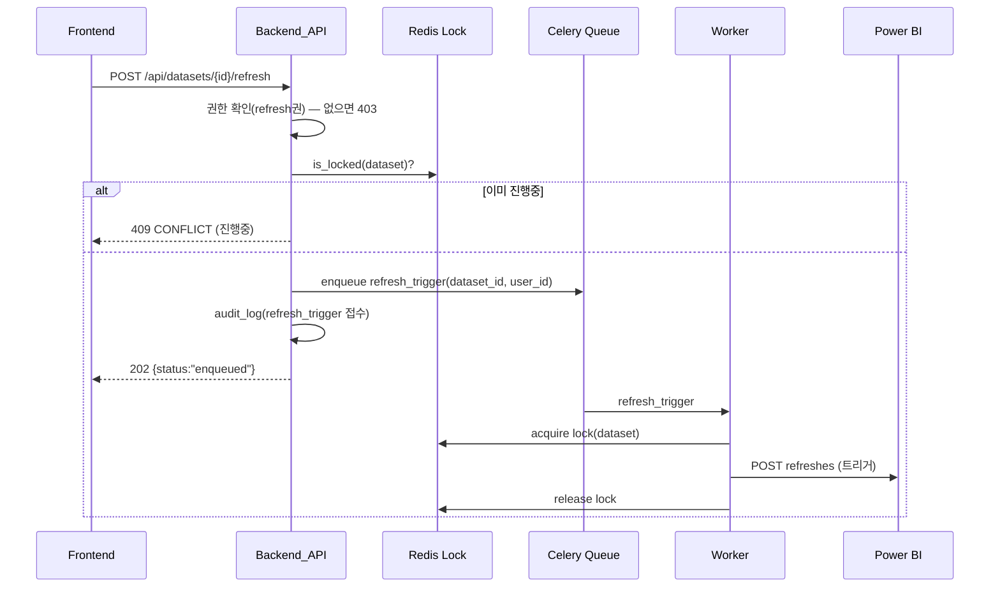
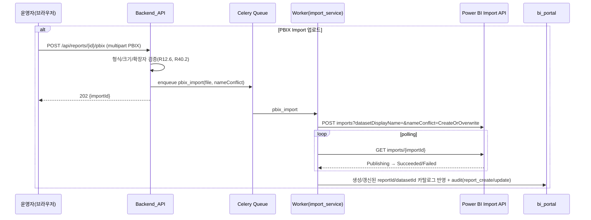
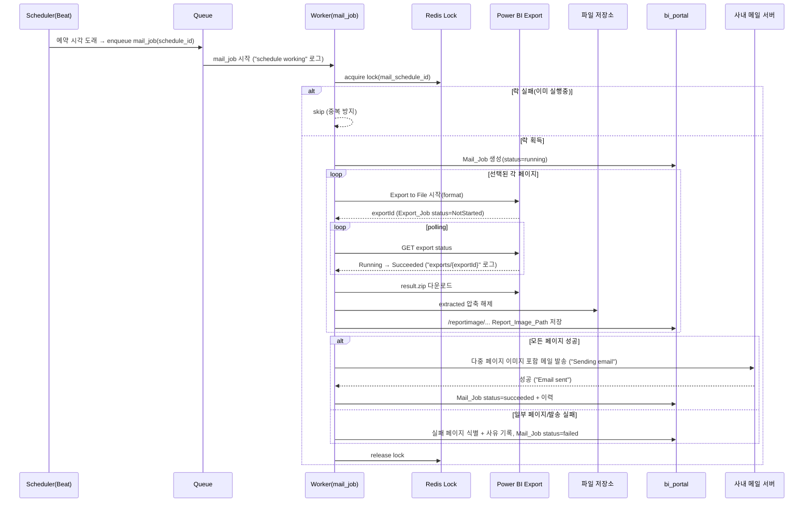

# Design Document — The New BI Portal (BIP)

## Overview

> **문서 최신 상태(2026-07)**: 2026-06~07 운영 피드백 반영 설계(엔드포인트 추가/제거, 마이그레이션, 권한/그룹/메일/레포트 변경)는 본 문서 하단 **"2026-06~07 운영 피드백 반영 설계 요약"**에 정리되어 있다. 요구사항은 `requirements.md`, 결정 로그는 RDL(D-01~D-25), 전체 작업 분해(WBS)는 `tasks.md` 상단 "작업 분해 구조(WBS)" 참조.

BI Portal(이하 BIP)은 현재 외부 업체 솔루션으로 운영 중인 "사내 Power BI 레포트 공유 웹 포털"을 자체 개발 시스템으로 대체하는 운영 등급 내부 포털이다. 단순 게시판이 아니라 Power BI Embedded 레포트 조회, 사용자/그룹/권한 관리, 인사정보 DB 기반 사번/비밀번호 로그인, 데이터셋 새로고침 상태 표시, Power BI Export 기반 정기 메일 발송, 서비스 센터, 운영 로그/모니터링/통계를 포함한다.

본 설계는 다음 핵심 결정에 기반한다. 각 결정의 대안 비교와 되돌리기 난이도는 `risk-and-decision-log.md`(이하 RDL)에 결정 ID(D-XX)로 정리하며, 본 문서의 대안 비교표와 동일 ID로 상호 참조한다.

1. **기존 `powerbi-refresh-monitor`(이하 PRM) 자산 재활용** — FastAPI 라우트 구조, Celery Collector/Worker/Beat, React Gantt/타임테이블, PowerBI client/token service, Redis 분산 락, Alembic, 이중 시간 컬럼(UTC/Local) 패턴을 그대로 계승한다. BIP는 PRM을 확장하여 인증/권한/레포트/메일/서비스 센터/감사 도메인을 추가한다. **재활용 가능한 경우 PRM 자산을 우선 사용**하되, **PRM 코드 의존성으로 BIP 핵심 기능(인증·권한·Embed 조회·Export 메일) 구현이 지연되면, Refresh History 수집(R14)과 Refresh 실행 현황 Gantt 화면(R15)을 v1.0 optional 또는 v1.1+로 분리하는 것을 비상 옵션으로 둔다**(RK-18). (충족: R14, R15, R26, R32)
2. **운영 원장은 PostgreSQL `bi_portal`(AWS RDS, 서울), Redis는 cache/queue/lock/token cache 전용** — Job 원장(Mail_Job, Export_Job, Refresh_Run 등)은 모두 PostgreSQL에 저장하고 Redis는 휘발성으로만 사용한다. 인사정보 뷰(`scl_v_insa_*`)도 동일 DB에 있으나 읽기 전용으로만 참조한다. (충족: R25.5, R29.4, R37)
3. **모든 권한 검증은 Backend에서 수행** — Frontend의 메뉴/버튼 숨김은 UX 보조일 뿐 통제 수단이 아니다. 권한은 사용자 직접 + 역할 + 부서 + 그룹 권한의 합집합으로 Backend가 계산·강제한다. (충족: R8, R22, R23, R24)
4. **Power BI secret/master token은 Backend/Worker에만 존재** — Embed Token, Export, Refresh, Import 호출은 전부 서버 측에서만 수행하고 Frontend에는 단기 Embed Token과 임베드 메타데이터만 전달한다. (충족: R9.4, R32.5, R38)
5. **장기 작업은 Worker로 위임** — Export/Refresh/메일/Refresh History 동기화는 FastAPI 요청 스레드에서 직접 처리하지 않고 Celery 작업으로 위임하며, Redis 분산 락으로 중복 실행을 방지한다. (충족: R13.3, R16, R27.2, R37)
6. **1인 12주 제약 → v1.0 우선, v1.1+는 확장 포인트로 분리** — 본 문서는 v1.0 설계를 상세화하고, v1.1+(전체 대시보드 통합, AI 분석, PBIX 완전 셀프 업로드)는 확장 지점만 명시한다. (충족: R26)

본 문서 구성: Overview → Architecture → Components and Interfaces → Data Models → Correctness Properties → Error Handling → Testing Strategy → 보안/성능/운영 리스크 → Requirements Traceability.

### v1.0 범위 요약

SSO 부재로 인사정보 DB 기반 사번/비밀번호 로그인, 비상 로컬 관리자 로그인, 사용자 자동 매핑, 사용자/그룹/역할/권한 관리, Power BI Embedded 조회, 새로고침 상태 표시, 레포트 등록(ID 수동 + PBIX Import API 업로드), 수동 새로고침, Refresh History 동기화, Refresh 실행 현황 화면 편입, Export 기반 정기 메일 발송, 서비스 센터(문의/에러 수정 요청), 기본 통계 대시보드, 자동 리렌더링, 감사 로그, 운영 모니터링, Job 중복 방지, 보안.

### v1.1+ 확장 포인트

전체 PRM 대시보드 통합(R20), AI 분석(R21), PBIX 완전 셀프 업로드/자동 검수(R12 고도화). Embedded 용량 자동 스케일은 v1.2(D-21). 전체 대시보드·AI 분석은 데이터 모델/라우트가 본 문서에 설계돼 있으나 v1.0 구현 범위에서는 제외한다. 서비스 센터의 v1.1+ 고도화(카테고리 세분화, 알림 채널 확장(사내 메신저 등), 영업시간 기반 SLA, 첨부 바이러스 스캔)는 별도 분리한다.

## Architecture

### 1. 전체 시스템 아키텍처

```mermaid
flowchart LR
    User["사내 사용자<br/>브라우저 (내부망)"]
    AAD["Azure AD<br/>OAuth2 Token EP"]
    PBI["Power BI REST API<br/>api.powerbi.com"]
    SMTP["사내 메일 서버<br/>(SMTP &lt;SMTP_HOST&gt;:587)"]

    subgraph Compose["Docker Compose 네트워크 (bip-net, 내부망 전용)"]
        NGINX["nginx<br/>리버스 프록시 :80/443"]
        FE["Frontend_App<br/>React 19 + Vite 6 (정적 빌드)"]
        BE["Backend_API<br/>FastAPI :8000"]
        WK["Worker<br/>Celery"]
        SC["Scheduler<br/>Celery Beat"]
        RD[("Redis 7<br/>cache/queue/lock/token")]
        FILES[["파일 저장소(StorageService)<br/>/reportimage, extracted<br/>(Docker volume / NAS)"]]
    end

    PG[("PostgreSQL 16<br/>bi_portal (AWS RDS, 서울)<br/>운영 원장 + 인사정보 뷰 scl_v_insa_*")]

    User -->|HTTPS| NGINX
    NGINX -->|/| FE
    NGINX -->|/api/*| BE
    NGINX -.|/reportimage/* (선택·내부망 편의, 기본 off)|.-> FILES
    BE -->|asyncpg| PG
    BE -.인사정보 뷰 읽기전용 인증/매핑.-> PG
    BE -->|redis.asyncio| RD
    BE -->|enqueue| RD
    SC -->|beat schedule| RD
    WK -->|consume queue| RD
    WK -->|asyncpg| PG
    WK -->|token+lock| RD
    WK -->|이미지/zip 쓰기| FILES
    BE -->|이미지 경로 읽기| FILES
    BE -.Embed/Refresh/Import.->|httpx| PBI
    WK -.Export/Refresh/수집.->|httpx| PBI
    WK -.client credentials.-> AAD
    BE -.client credentials.-> AAD
    WK -->|메일 발송| SMTP
```

핵심 경계:
- **외부 PostgreSQL `bi_portal`**: 기존 데이터플랫폼의 AWS RDS PostgreSQL(서울 리전 `ap-northeast-2`) 내 BIP 전용 DB. **현재 제공된 `bi_portal`은 개발계(dev)이며, 운영계(prod)는 추후 동일 구조로 구축한다.** Compose 외부에 위치하며 `DATABASE_URL`로 연결한다(Compose에 postgres 서비스를 띄우지 않음). 로컬 단위테스트/CI는 `docker-compose.test.yml`의 일회용 PostgreSQL 사용. **개발계↔운영계 이관은 Alembic 마이그레이션을 단일 진실 소스로 삼아 코드로 재현**한다(환경별 데이터는 이관하지 않고 스키마/시드만 재현). RDS는 SSL 필수(`sslmode=require`), 보안 그룹 인바운드(5432) 허용 필요. (충족: R25.3, R25.4, R29.2)
- **secret 경계**: Power BI/Azure/SMTP secret은 `backend`/`worker`/`scheduler` 컨테이너 환경 변수로만 주입되고 `frontend` 빌드에는 절대 포함하지 않는다. (충족: R38)

### 2. Docker Compose 컴포넌트 구성

| 서비스 | 이미지/빌드 | 역할 | secret 접근 | 비고 |
|---|---|---|---|---|
| `nginx` | nginx:alpine | 리버스 프록시, 정적 서빙(`/` frontend), `/api/*` 프록시, TLS 종단. `/reportimage/*` 정적 서빙은 **선택(기본 off)** | 없음 | 내부망 전용 진입점 |
| `frontend` | build ./frontend | React 정적 빌드 산출물 | **없음** | nginx가 서빙 (단독 노출 안 함) |
| `backend` | build ./backend | FastAPI, entrypoint에서 `alembic upgrade head` 후 uvicorn | 있음 | `/api/health` healthcheck |
| `worker` | build ./backend | Celery worker (수집/Export/메일/Refresh) | 있음 | backend healthy 후 기동 |
| `scheduler` | build ./backend | Celery Beat (동기화/메일 스케줄 트리거) | 있음 | worker 후 기동 |
| `redis` | redis:7-alpine | cache/queue/lock/token cache | 없음 | 원장 저장 금지 |
| (외부) `bi_portal` | PostgreSQL 16+ (AWS RDS, 서울) | 운영 원장 + 인사정보 뷰 | — | Compose 외부, `DATABASE_URL` 연결 |

PRM의 기존 compose 6서비스(postgres/redis/backend/frontend/worker/scheduler)에서 **postgres 제거(외부 DB로 대체)** + **nginx 추가**가 BIP의 주요 변경점이다. (충족: R25.3, R25.6)

### 3. 인증/권한 흐름 개요



모든 보호된 엔드포인트는 `Depends(get_current_user)`로 세션·사용자를 해석하고, 이어서 `Depends(require_role(...))` 또는 `Depends(require_report_permission(report_id, action))`(action=VIEW/DOWNLOAD/REFRESH/MANAGE_REPORT)로 권한을 재검증한다. (충족: R23)

### 4. 런타임 모드 (Mock vs Live) 계승

PRM의 `APP_MODE`(mock/live) 토글을 그대로 계승한다. `APP_MODE=mock`이면 Power BI/Azure 호출이 mock 구현체로 대체되어 외부 의존 없이 전체 화면을 개발/시연할 수 있다. 인증도 `AUTH_MODE`(`hr-db`/`mock`/`local-only`)로 분리하여 개발 시 mock 사용자로 로그인하거나(인사 DB 없이), 운영에서는 `hr-db`(인사정보 DB 인증)를 사용한다(D-01 참조). (충족: R26.5)

## Components and Interfaces

### Backend FastAPI 모듈 구조

PRM의 모듈 구조를 계승하고 도메인(auth/users/groups/roles/reports/embed/refresh/mail/requests/audit/stats/health)을 추가한다. 굵게 표시한 항목이 BIP 신규, 나머지는 PRM 재활용/확장이다.

```
backend/app/
├── main.py                     # FastAPI 앱, 라우터 마운트, lifespan, 미들웨어(request_id, auth)
├── core/
│   ├── config.py               # Pydantic Settings (PRM 확장: HR인증/SMTP/Storage/세션 env 추가)
│   ├── logging.py              # 구조화 로그 + 시크릿 마스킹 (재활용)
│   ├── timezone.py             # UTC↔APP_TIMEZONE 변환 (재활용)
│   ├── errors.py               # 공통 오류/예외 (확장)
│   ├── constants.py            # enum(역할/상태) (확장)
│   └── deps.py                 # get_db, get_redis, get_powerbi_client,
│                               #   **get_current_user, require_role, require_report_permission**
├── db/
│   ├── base.py / session.py / redis.py   # 재활용
├── migrations/                 # Alembic (BIP 신규 테이블 마이그레이션 추가)
├── models/                     # SQLAlchemy 모델
│   ├── workspace.py report.py dataset.py refresh_run.py refresh_schedule.py   # 재활용/확장
│   ├── **user.py role.py user_role.py department.py**
│   ├── **user_group.py user_group_member.py**
│   ├── **report_permission.py report_folder.py**
│   ├── **mail_schedule.py mail_schedule_page.py mail_job.py**
│   ├── **export_job.py report_image_path.py**
│   ├── **request_center.py audit_log.py local_admin.py**
├── schemas/                    # Pydantic v2 I/O 스키마 (도메인별)
│   ├── common.py refresh.py report.py dataset.py schedule.py   # 재활용/확장
│   ├── **auth.py user.py group.py role.py permission.py**
│   ├── **embed.py mail.py request.py audit.py stat.py**
├── services/
│   ├── powerbi/                # PRM 재활용 + 확장
│   │   ├── client.py live_client.py mock_client.py     # Protocol + 구현 (확장: embed/export/import 메서드)
│   │   ├── token_service.py                            # Azure AD token (재활용)
│   │   ├── **embed_service.py**                        # Embed Token 발급
│   │   ├── **export_service.py**                       # Export to File polling
│   │   ├── status_mapper.py error_parser.py            # 재활용
│   │   ├── collector.py                                # Refresh History 수집 (재활용)
│   │   └── lock.py                                     # Redis 분산 락 (재활용, 키 prefix 일반화)
│   ├── cache.py                # Redis 캐시 (재활용)
│   ├── refresh_query.py summary.py                     # 조회/집계 (재활용/확장)
│   ├── **auth/hr_authenticator.py auth/session_service.py auth/user_mapper.py auth/local_admin.py auth/password_hash.py**
│   ├── **permission_service.py**     # 권한 합집합 계산
│   ├── **mail/mail_service.py mail/template.py mail/image_service.py**
│   ├── **request_service.py audit_service.py stats_service.py storage_service.py**
└── api/routes/
    ├── health.py reports.py datasets.py schedules.py refresh.py summary.py collect.py   # 재활용/확장
    ├── **auth.py users.py groups.py roles.py permissions.py**
    ├── **embed.py mail_schedules.py mail_jobs.py requests.py audit.py stats.py monitoring.py**
└── workers/
    ├── celery_app.py beat_schedule.py        # 재활용 (BIP 스케줄 추가)
    └── tasks/
        ├── collect.py                        # Refresh History 수집 (재활용)
        ├── **refresh_trigger.py**            # 수동 새로고침 실행
        ├── **mail_job.py**                   # Export→ZIP→이미지→메일 파이프라인
        └── **export_poll.py**                # Export 상태 polling (mail_job 내부 호출도 가능)
```

#### 주요 신규 컴포넌트 책임

| 컴포넌트 | 책임 | 주요 의존성 |
|---|---|---|
| `auth/hr_authenticator.py` | 인사정보 뷰(`scl_v_insa_*`) 읽기전용 조회로 사번/비밀번호(SHA256³) 검증, Job_Context 후보 산출 | bi_portal 인사 뷰 (D-01) |
| `auth/session_service.py` | BIP 세션 생성/검증/무효화, 만료 적용 | Redis(세션 저장, D-02) |
| `auth/user_mapper.py` | 최초 로그인 시 사용자 자동 생성, 재로그인 시 부서/직급/cmp_email 갱신, 기본 역할 부여 | DB, audit_service |
| `auth/local_admin.py` | 비상 로컬 관리자 자격 검증(해시), 로그인 제한 | DB(`local_admins`), audit_service |
| `permission_service.py` | 사용자 직접+역할+부서+그룹 권한 합집합 계산, 캐시 | DB, Redis(D-08) |
| `powerbi/embed_service.py` | Report 한정 Embed Token 발급, master token 비노출 | token_service, live_client |
| `powerbi/export_service.py` | Export to File 시작, 상태 polling, result.zip 다운로드 | live_client |
| `mail/mail_service.py` | SMTP 발송, 성공/실패 로그, 재시도 | smtplib/aiosmtplib (D-12) |
| `mail/image_service.py` | 메일 이미지 픽셀 리사이즈(다운스케일, 비율 유지, 원본 보존) | Pillow |
| `storage_service.py` | StorageService 추상화(local/nas/s3), reportimage/extracted 경로·메타 관리, 정리 정책 | 파일 시스템/NAS (D-09) |
| `powerbi/import_service.py` | PBIX Import API 업로드(`POST imports`)·Import 상태 polling | live_client (D-15) |
| `audit_service.py` | Audit_Log append, 시크릿 미기록 보장 | DB |

### API 설계

모든 응답은 JSON/UTF-8, 사용자 노출 메시지는 한국어. 모든 보호 엔드포인트는 인증(401) + 권한(403) 재검증을 거친다. 권한 표기: G=General_User, S=Super_User, O=System_Operator, (자기 자신)=본인 리소스.

#### 인증 (`/api/auth`)

| 메서드 | 경로 | 설명 | 권한 | 충족 |
|---|---|---|---|---|
| POST | `/api/auth/login` | 사번(`emp_no`)+비밀번호 로그인(인사 DB 검증→세션 생성→자동 매핑) | 익명 | R1.1~1.4, R3, R33 |
| GET | `/api/auth/job-contexts` | 로그인 사용자의 겸직 Job_Context 후보 목록 **[v1.1+]** | 인증됨(선택 전) | R1.7 |
| POST | `/api/auth/job-context` | 활성 Job_Context 선택→세션 반영 **[v1.1+]** | 인증됨 | R1.7, R3.6 |
| POST | `/api/auth/local/login` | 비상 로컬 관리자 로그인 | 익명 | R2 |
| POST | `/api/auth/logout` | 세션 무효화 | 인증됨 | R39.2 |
| GET | `/api/auth/me` | 현재 사용자/역할/권한 요약 | 인증됨 | R22.1 |

#### 사용자/그룹/역할/권한

| 메서드 | 경로 | 설명 | 권한 | 충족 |
|---|---|---|---|---|
| GET | `/api/users` | 사용자 목록(식별자/이름/부서/메일/역할/활성) | O | R4.1 |
| PATCH | `/api/users/{id}/status` | 비활성화/재활성화 | O | R4.2, R4.3 |
| POST | `/api/groups` | 그룹 생성 | O | R5.1 |
| PATCH/DELETE | `/api/groups/{id}` | 그룹 수정/삭제(연관 권한·멤버 cascade) | O | R5.2~5.4 |
| POST/DELETE | `/api/groups/{id}/members` | 그룹원 추가/제거(멱등) | O | R6 |
| GET | `/api/roles` | 역할 목록 | O | R7.1 |
| POST/DELETE | `/api/users/{id}/roles` | 역할 부여/회수(최소 General 보장) | O | R7.2~7.4 |
| POST/DELETE | `/api/reports/{id}/permissions` | 레포트 권한 부여/회수(주체=user/role/dept/group, 권한=VIEW/DOWNLOAD/REFRESH/MANAGE_REPORT/VIEW_STATS) | O | R8.1~8.3 |
| GET | `/api/reports/{id}/permissions` | 레포트 권한 목록 | O | R8 |

#### 레포트/임베드/새로고침

| 메서드 | 경로 | 설명 | 권한 | 충족 |
|---|---|---|---|---|
| GET | `/api/reports` | 조회 권한 보유 + 공개 레포트 목록(새로고침 요약 포함, folder_id 필터) | G+ | R8.4, R10.2, R11.4, R24.1, R41.4 |
| GET/POST/PATCH/DELETE | `/api/report-folders` | 레포트 폴더(트리) CRUD | O | R41.1, R41.2, R41.5 |
| GET | `/api/report-folders/tree` | 폴더 트리 + 권한 필터된 레포트 노출 | G+ | R41.4 |
| PATCH | `/api/reports/{id}/folder` | 레포트의 소속 폴더 이동 | O | R41.3 |
| PATCH | `/api/reports/{id}` | 메타데이터 수정 | O | R11.2 |
| PATCH | `/api/reports/{id}/visibility` | 공개/비공개 전환 | O | R11.3 |
| POST | `/api/reports/{id}/pbix` | PBIX Import API 업로드(신규/갱신, Worker 위임) | O | R12.3~12.6 |
| GET | `/api/reports/imports/{importId}` | PBIX Import 진행/결과 조회 | O | R12.4 |
| GET | `/api/reports/{id}/embed` | Report 한정 Embed Token + 임베드 정보 발급 | 해당 Report 조회권 | R9.1, R9.3, R24.2 |
| POST | `/api/reports/{id}/export` | Export to File 직접 요청(Worker 위임, 202 반환) | 해당 Report DOWNLOAD권 | R9.6 |
| GET | `/api/exports/{id}` | Export 상태/결과 조회 + 다운로드 수단 | 요청자 본인 또는 O | R9.7 |
| GET | `/api/reports/{id}/refresh-status` | 마지막 Refresh_Run + 다음 예약(Local_Time) | 해당 Report 조회권 | R10.1, R10.2 |
| POST | `/api/datasets/{id}/refresh` | 수동 새로고침 트리거(Worker 위임, 진행중이면 차단) | 해당 Dataset refresh권 | R13 |
| GET | `/api/refresh-history`, `/api/refresh-timetable`, `/api/refresh-schedules`, `/api/summary`, `/api/refresh-latest-date` | PRM 편입 화면 데이터(단일 일자 조회, latest-date=기본 선택 일자) | 모니터링 접근권 | R15.3 |
| POST | `/api/collect-now` | 즉시 동기화(HTTP 202, 분산락 점유 시 already-running) — 감사로그 `collect_now` | 모니터링 접근권(monitoring_refresh) | R14 |
| GET | `/api/collect-status` | 현재 수집 진행 여부(분산락 점유) — Refresh 화면 진행 배너 폴링 | 모니터링 접근권(monitoring_refresh) | R14 |

#### 메일/요청센터/감사/통계/모니터링

| 메서드 | 경로 | 설명 | 권한 | 충족 |
|---|---|---|---|---|
| GET/POST/PATCH/DELETE | `/api/mail-schedules` | 메일 스케줄 CRUD(페이지명 다중 선택·순서, 수신자 USER/GROUP/DEPARTMENT/EMAIL, 제목·안내문구·이미지 폭 커스터마이징, 주기/시간/기간) | O | R16.1, R16.2, R16.14, R16.15 |
| GET | `/api/reports/{id}/pages` | 레포트 Power BI 페이지 목록(메일 스케줄 페이지명 선택용) | O | R16.2 |
| GET | `/api/mail-jobs` | 메일 발송 성공/실패 이력 조회 | O | R16.13 |
| GET | `/api/report-images/{id}` | 저장 이미지 권한 검증 다운로드(스트리밍) | 해당 Mail_Job/Report 열람권 | R16.9, R38 |
| POST | `/api/mail-jobs/{id}/retry` | 실패 Mail_Job 재시도 | O | R16.12, R34.3 |
| POST | `/api/requests` | 문의/에러 요청 생성 | 인증됨 | R17.1 |
| GET | `/api/requests` | 본인 요청 조회 / (O는 전체) | 인증됨/O | R17.2, R17.3 |
| GET | `/api/requests/{id}` | 요청 상세(본인 또는 O) | 인증됨/O | R17.2, R17.3 |
| PATCH | `/api/requests/{id}` | 상태 변경/응답 등록 | O | R17.3 |
| POST | `/api/requests/{id}/attachments` | 첨부 업로드(이미지/문서) | 소유자/O | R17.5 |
| GET | `/api/requests/{id}/attachments` | 첨부 목록 | 소유자/O | R17.5 |
| GET | `/api/request-attachments/{id}` | 첨부 다운로드(권한 검증 스트리밍) | 소유자/O | R17.5 |
| DELETE | `/api/request-attachments/{id}` | 첨부 삭제 | 소유자/O | R17.5 |
| POST | `/api/requests/{id}/comments` | 댓글 작성(요청자/운영자) | 소유자/O | R17.7 |
| GET | `/api/audit-logs` | 기간/주체/행위 종류 필터 조회 | O | R35.3 |
| GET | `/api/stats/reports` | 통계 조회 가능 레포트 목록(드롭다운): O=전체, Super_User=VIEW_STATS 부여분 | 통계 접근권 | R18.4 |
| GET | `/api/stats/overview` | 접속/조회/새로고침/메일/실패Job 집계(기간 필터, report_id 지정 시 해당 레포트만) | 통계 접근권(O) | R18.1, R18.5 |
| GET | `/api/stats/usage` | 인기 리포트 TOP10·부서별/월별 리포트 수·사용자별 조회·Export/Refresh 실패·미사용 리포트(기간 필터, report_id 지정 가능) | 통계 접근권(O) | R18.2, R18.3, R18.5 |
| GET | `/api/health` | 시스템 가용 상태 | 익명 | R36.1 |
| GET | `/api/monitoring/status` | DB/Redis/Worker/최근 작업 결과 지표 | O | R36.2, R36.3 |

#### 공통 오류 응답

PRM 형식을 계승한다.

```json
{ "errorCode": "PERMISSION_DENIED", "errorDescription": "이 작업을 수행할 권한이 없습니다.", "details": {} }
```

| 상황 | HTTP | errorCode |
|---|---|---|
| 입력 검증 실패 | 400 | `VALIDATION_ERROR` |
| 미인증/세션 만료 | 401 | `UNAUTHENTICATED` |
| 권한 부족 | 403 | `PERMISSION_DENIED` |
| 리소스 없음 | 404 | `NOT_FOUND` |
| 중복/충돌(진행중 새로고침 등) | 409 | `CONFLICT` |
| Power BI 연동 실패 | 502 | `POWERBI_ERROR` |
| 큐 사용 불가 | 503 | `QUEUE_UNAVAILABLE` |
| 내부 오류 | 500 | `INTERNAL_ERROR` |

### 인증(인사정보 DB) + 비상 로컬 관리자 + 자동 매핑 설계

#### 인사정보 DB 기반 로그인 흐름 (SSO 부재)



- 인증은 `hr_authenticator`가 인사 뷰를 **읽기 전용**으로 조회하여 `sha256³(입력비번) == login_pwd`로 검증한다. 해시는 **단순 SHA-256 3회 반복 + 64자 소문자 hex 저장**(실측 확정, salt 없음). 라운드 간 입력 형태(hex 문자열 재해싱 vs digest 바이트)만 알려진 샘플로 확정. 인증 로직을 한 모듈로 격리하여 향후 그룹웨어 SSO 도입 시 `Authenticator` 인터페이스 교체로 전환.
- 컬럼/조인(실측): 인증 `scl_v_insa_user_add_pwd(emp_no, login_pwd, cmp_email, user_name, emp_status)`, 프로필 `scl_v_insa_user`, 조직·직급 `scl_v_insa_my_job(emp_no, cmp_id, dept_id, ofc_id, bass_dept_yn)` → 부서 `(cmp_id, dept_id)`=`scl_v_insa_dept_add_depth`, 직급 `(cmp_id, ofc_id)`=`scl_v_insa_office`.
- 세션 저장 방식은 D-02(쿠키 세션 토큰 + Redis 세션 저장). 세션에는 만료 시간 적용, 로그아웃 시 무효화. (충족: R39.1, R39.2)
- **레거시 해시 검증(보안 주의)**: SHA-256 단순 3회 반복은 **신규 비밀번호 저장 방식으로 권장되지 않는다**(salt 없음, 느린 KDF 아님). 본 방식은 기존 인사정보 DB의 `login_pwd`(그룹웨어가 생성)를 검증하기 위해 **불가피하게 사용하는 레거시 검증 방식**이다. BIP는 사용자의 **비밀번호나 그 해시를 자체 저장하지 않으며**(인사 뷰는 읽기 전용 참조), 입력 비밀번호는 **요청 처리 중 메모리에서만 사용하고 로그/응답/Audit_Log에 남기지 않는다**. (충족: R1.6, R39)
- **Job_Context(겸직) — v1.0는 기본 부서 단일, 선택은 v1.1+**: v1.0에서는 로그인 시 인사 뷰 `scl_v_insa_my_job`에서 `bass_dept_yn='Y'` 우선(없으면 `emp_sort_ordr` 최상위) **1건을 기본 부서로 자동 매핑**하고 별도 선택 UI를 두지 않는다 → `users.department_id`에 저장, 권한 계산의 부서 출처로 사용.
- **모델 가정(중요)**: 로그인 ID(`emp_no`) = **단일 회사·단일 정체성**으로 취급한다. **계열사 간 겸직은 계열사마다 ID 체계가 달라 로그인 ID(`emp_no`) 자체가 분리**되므로(서로 다른 사용자처럼 동작), BIP는 추가 겸직 처리 없이 일반 로그인과 동일하게 다룬다. 따라서 다중 Job_Context는 "동일 회사 내 다중 부서/직책"인 경우에만 의미가 있으며, 그조차 v1.0은 기본 부서 1건으로 충분하다. 다중 Job_Context 후보 제시·선택·세션 전환은 **v1.1+**로 분리한다(원천 `my_job` 동일, 확장 시 매핑 로직만 추가). 실측상 동일 `emp_no` 다중행은 소수(~119/9183)이며 상당수는 시스템 계정의 회사별 중복으로 추정된다.

#### 비상 로컬 관리자

- `local_admins` 테이블에 username + password_hash(argon2id, 대안 bcrypt) 저장. 평문 저장 금지. (충족: R39.3)
- 인사 DB 인증과 완전히 독립된 경로(`/api/auth/local/login`). 성공 시 System_Operator 세션 생성. 인사 DB 장애 시 운영 접근 유지. (충족: R2.1, R2.2, R33.2)
- 모든 시도(성공/실패)를 Audit_Log에 기록. 반복 실패 감지 시 제한(rate limit + lockout). (충족: R2.4, R39.4)

#### 사용자 자동 매핑

- 최초 인증: 인사 뷰의 사번(`emp_no`)/이름/부서(`dept_id`)/직급(`ofc_id`)/회사메일(`cmp_email`)로 `users` 레코드 생성 + `user_roles`에 General_User 부여. `users.external_id=emp_no`, `departments.external_id=dept_id`. (충족: R3.1, R3.3, R3.5)
- 재로그인: 부서/직급/cmp_email 변경 시 갱신. (충족: R3.2)
- 비활성 사용자는 신규 세션 생성 거부. 비활성화 처리 시 `bip:user_sessions:{user_id}` Set에 등록된 모든 세션 키를 Redis에서 즉시 삭제한다. (충족: R4.3)
- 모든 매핑/갱신 행위 Audit_Log 기록. (충족: R3.4)

### 사용자 그룹 및 권한 계산 설계

레포트 접근 권한은 4종 주체(Permission_Subject)의 합집합으로 계산한다.

```mermaid
flowchart LR
    U[사용자] --> D[직접 권한<br/>subject_type=user]
    U --> RO[역할 권한<br/>subject_type=role]
    U --> DE[부서 권한<br/>subject_type=dept]
    U --> GR[그룹 권한<br/>subject_type=group]
    D & RO & DE & GR --> UNION[합집합 = 접근 가능 Report 집합]
    UNION --> FILTER[+ 공개 상태 필터(R11.4)]
```

권한 계산 SQL 골자(개념) — 액션별 권한 검사. 목록/조회는 `VIEW`, 새로고침은 `REFRESH` 등 요청 액션에 대응하는 `permission`을 확인:

```sql
-- 예: 사용자가 VIEW 권한을 가진 Report 집합 (목록 노출용). 다른 액션은 :action만 교체
-- v1.0: dept 출처는 users.department_id(기본/대표 부서 단일). 겸직 활성 선택은 v1.1+.
SELECT DISTINCT rp.report_id
FROM report_permissions rp
WHERE rp.permission = :action /* VIEW | DOWNLOAD | REFRESH | MANAGE_REPORT */ AND (
    (rp.subject_type='user'  AND rp.subject_id = :user_id)
 OR (rp.subject_type='role'  AND rp.subject_id IN (SELECT role_id FROM user_roles WHERE user_id=:user_id))
 OR (rp.subject_type='dept'  AND rp.subject_id = (SELECT department_id FROM users WHERE id=:user_id))
 OR (rp.subject_type='group' AND rp.subject_id IN (SELECT group_id FROM user_group_members WHERE user_id=:user_id))
);
```

- **v1.0 부서 권한 출처 = `users.department_id`(기본/대표 부서 단일)**. 겸직 사용자도 v1.0에서는 기본 부서 하나만 사용한다 — 로그인 시 인사 뷰의 `bass_dept_yn='Y'` 우선(없으면 `emp_sort_ordr` 최상위 1건)을 기본 부서로 매핑한다. 컨텍스트 선택이 없으므로 "선택 부서 ≠ 계산 부서" 모순이 발생하지 않는다.
- **겸직 활성 부서 선택(Job_Context)은 v1.1+로 분리**. v1.1+에서 세션 활성 부서(`active_department_id`)를 부서 권한 출처로 확장하며, 그때도 `users.department_id`는 기본값/표시용으로 유지한다.

- **액션별 권한 enum(v1.0)**: `VIEW`(조회/임베드), `DOWNLOAD`(Export/다운로드), `REFRESH`(수동 새로고침), `MANAGE_REPORT`(레포트 메타/공개 관리 위임). **v1.1+**: `SCHEDULE_REFRESH`(예약 새로고침 변경), `MANAGE_PERMISSION`(권한 위임). 한 (subject, report)에 복수 권한 행 허용(UNIQUE(report_id, subject_type, subject_id, permission)).
- 권한 검사는 액션별로 수행: 목록/임베드=`VIEW`, `/datasets/{id}/refresh`=`REFRESH`, Export/다운로드=`DOWNLOAD`, 레포트 수정/공개=`MANAGE_REPORT`(또는 System_Operator). `permission_service.has_permission(user, report, action)`로 단일화.
- System_Operator는 모든 액션을 보유한 것으로 간주(전체 관리 접근, R24.3). MANAGE_REPORT 권한 보유자는 해당 레포트에 한해 관리 위임.

- 계산 방식은 D-08(v1.0 요청 시 동적 계산 추천, 권한·그룹 변경 시 캐시 무효화하는 단기 캐시 병행 옵션). 권한/그룹/역할 변경 시 해당 사용자의 권한 캐시를 무효화. (충족: R8.3, R22.4, R24.1)
- System_Operator는 관리 데이터 전체 접근. (충족: R24.3)

### Power BI Embedded 조회 설계 (App-Owns-Data)



- **App-Owns-Data(서비스 주체 단일 master) 채택 확정(D-06)**. master token/secret은 Backend에만 존재, Frontend엔 단기 Embed Token만 전달. 포털 사용자는 Power BI에 직접 로그인하지 않는다. (충족: R9.1, R9.4, R24.2, R38)
- Embed Token은 요청 Report에만 한정(`reports`, `datasets`, `accessLevel`). 권한 없는 Report 요청은 403. (충족: R9.3)
- RLS(행 수준 보안)는 v1.0 필수 아님. 레포트 접근 통제는 BIP의 사용자/역할/부서/그룹 권한으로 처리. 동일 레포트 내 사용자별 행 수준 제한이 필요한 경우 v1.1+ 또는 별도 PoC(D-06).
- 조회(토큰 발급) 행위 Audit_Log 기록. (충족: R9.5)

#### Embedded 용량(A SKU) — v1.0 수동 운영 / 자동 스케일 v1.2 연기 (D-21)

- 현재 용량은 **Power BI Embedded A1(1 v-core, 3GB RAM)**. A SKU의 단일 모델 메모리 한계가 곧 노드 RAM이라, A1=3GB에서 대형 모델 새로고침 시 메모리 부족 에러가 발생한다. A SKU는 노드 타입을 스케일 업/다운 가능하며 **워크스페이스 ID가 불변**이므로 BIP 코드/설계 변경 없이 용량만 조정된다.
- **v1.0 방침**: 용량은 **수동 운영**. 메모리 에러가 심하면 운영자가 Azure Portal에서 노드를 수동 스케일 업(예: 상시 A2)하거나 새벽 새로고침 전후로 수동 조정한다. v1.0 BIP는 용량 스케일 로직을 포함하지 않는다.
- **자동 스케일(시간대별 A1↔A2, 예: 03~08시 A2)은 v1.2 고도화 범위로 연기**(D-21). 워크스페이스 ID 불변이라 v1.2 도입 시 코드/설계 영향 없이 추가 가능. 상세는 RDL D-21 참조.

- **DB 동기화 기반 표시 추천(D-03)**: Scheduler가 주기적으로 Power BI Refresh History를 수집(PRM Collector 재활용)하여 `refresh_runs`/`refresh_schedules`에 upsert하고, 화면은 DB에서 조회 → 빠르고 rate limit 안전. (충족: R10, R14)
- `refresh_runs`에 UTC와 Local(`APP_TIMEZONE`, 기본 Asia/Seoul) 컬럼을 모두 저장(이중 시간 컬럼, PRM 계승). Frontend는 Local을 추가 변환 없이 표시. (충족: R30)
- "실시간 조회 vs DB 동기화" 비교: 상세 화면에서 사용자가 강제 새로고침을 누르면 `/api/collect-now`로 즉시 동기화 후 재조회(하이브리드 옵션). 기본은 DB 동기화. (D-03)
- 이력 없으면 "새로고침 이력 없음" 표시, 상태는 성공/실패/진행중/알 수 없음 4종. (충족: R10.3, R10.4)

### 수동 새로고침 설계



- 장기 호출은 Worker 위임, 요청 스레드 비차단. 동일 Dataset 중복 트리거는 락으로 차단. (충족: R13.3, R13.4, R27.2, R37)

### 레포트 등록 / PBIX Import 업로드 설계 (D-15)

관리자(System_Operator)의 두 가지 등록 경로를 v1.0에 포함한다. 수퍼 사용자의 "등록 요청"은 그룹웨어 IT 요청서로 처리하므로 BIP 범위에서 제외한다.



- PBIX Import: 업로드 검증 → Worker 비동기 `POST imports`(`nameConflict`로 신규/갱신 제어) → Import 상태 polling → 성공 시 카탈로그 반영. (충족: R12.3~12.5)
- **ID 수동 등록/기존 레포트 게시 제거(D-15 갱신)**: 기존 임베디드 서버의 레포트를 ID로 가져와 등록하던 경로(`POST /api/reports`, `GET /api/powerbi/workspace-reports`, 관리자 UI "기존 레포트 게시")는 v1.0에서 제거했다. 헷갈림 방지 + 향후 신규 Embedded 서버로 전면 마이그레이션 예정이기 때문이며, 레포트 게시는 **PBIX 업로드 게시**로 일원화한다.
- **중요(데이터셋 자격증명/게이트웨이는 별도 수동)**: PBIX 업로드 = 워크스페이스 게시 = **임베드는 자동 가능**(워크스페이스가 A1 용량에 연결돼 있으므로). 그러나 **데이터셋의 데이터 원본 자격증명/온프레미스 게이트웨이 연결은 Import API가 자동 설정하지 않으며**, 새로고침이 필요한 레포트는 업로드 후 운영자가 **Power BI 포털에서 직접 설정**해야 한다(기존 운영 방식 동일). BIP는 이 단계를 자동화하지 않고, 업로드 결과 화면에 "데이터셋 자격증명/게이트웨이 설정 필요" 안내를 표시한다.
- 업로드 시 BIP **폴더(분류)** 지정: 업로드 화면에서 대상 폴더(계열사/팀/업무영역 등 자유 계층)를 선택하여 카탈로그에 분류 저장(Requirement 41). Power BI 워크스페이스 구조와는 독립이며 BIP 내부 분류이다.
- 업로드 검증 실패(형식/크기/확장자) 시 400 한국어 오류. 격리/스캔 정책은 보안 설계 참조. (충족: R12.6)
- 모든 등록/업로드 행위 Audit_Log 기록. (충족: R12.7)

### 레포트 폴더/분류 체계 설계 (R41)

- `report_folders`(자기참조 트리: `parent_id` nullable=루트, `name`, `folder_type`(company/team/domain 등 자유 라벨), `sort_order`)로 **계열사 > 팀 > 업무영역** 등 임의 깊이 분류를 표현(인접 리스트 모델). `reports.folder_id`로 레포트를 한 폴더에 배치.
- 폴더는 **BIP 내부 분류/탐색 체계**이며 Power BI 워크스페이스 구조와 독립. 관리자(System_Operator)가 CRUD, 레포트 등록/업로드 시 폴더 지정, 이후 이동 가능.
- Frontend는 `/api/report-folders/tree`로 폴더 트리를 사이드바에 렌더링하고, 폴더 선택 시 **해당 폴더+하위 폴더 소속 중 사용자가 조회권 보유한 레포트만** 노출(권한은 레포트 단위 그대로 적용, R8/R24). 무권한 레포트는 트리 카운트/목록에서 제외.
- 폴더 삭제 규칙: 하위 폴더/레포트가 있으면 (a) 삭제 거부 또는 (b) 상위로 이동 중 정의된 규칙으로 처리. 레포트의 Power BI 원본은 절대 삭제하지 않음(카탈로그 분류만 변경). (충족: R41.5)
- 폴더 단위 권한 부여(폴더 권한이 하위 레포트에 상속)는 편의 기능으로 **v1.1+**. v1.0 권한 단위는 레포트.
- **권한은 폴더와 독립**: Report_Permission은 항상 레포트 단위로 저장·판정하므로 **같은 폴더 안의 레포트들도 서로 다른 권한**을 가질 수 있다(R8.5, R41.7). 폴더 트리 노출 시에도 각 레포트는 자신의 권한으로 개별 필터링된다 — 폴더가 보인다고 그 안의 모든 레포트가 보이는 것이 아니라, 사용자가 권한을 가진 레포트만 해당 폴더 아래 나타난다. 권한 없는 레포트만 있는 폴더는 트리에서 비거나 숨길 수 있다.
- 폴더 변경 행위 Audit_Log 기록(`group_change`와 별도 action 또는 `report_update`). (충족: R41.6)

### Power BI Export 기반 정기 메일 발송 설계

기존 업체 솔루션의 흐름(schedule working → Export NotStarted/Running/Succeeded → exports/{exportId} → result.zip → extracted 압축해제 → /reportimage 경로 저장 → Lock 중복방지 → Sending/Email sent)을 기준 흐름으로 삼는다.



- 다중 페이지: `mail_schedule_pages`에 페이지별 행 저장, 각 페이지마다 Export_Job 생성. 각 Export_Job의 ExportTo 호출은 `powerBIReportConfiguration.pages:[{pageName}]`로 **해당 페이지만** 내보낸다(미지정 시 리포트 전체가 나와 모든 페이지가 같은 내용으로 채워지는 문제 방지). (충족: R16.2, R16.4)
- **수신자(mail_recipients) 해석**: 스케줄에는 수신 대상을 `recipient_type`(USER/GROUP/DEPARTMENT/EMAIL) + (recipient_id 또는 email)로 **참조만 저장**한다. Mail_Job 발송 시점에 각 행을 실제 이메일로 펼친다 — USER→`scl_v_insa_user.cmp_email`, GROUP→그룹원 사용자들의 cmp_email, DEPARTMENT→해당 부서 사용자들의 cmp_email, EMAIL→입력값 그대로. 펼친 결과를 정규화(소문자)·**중복 제거** 후 발송. 발송 시점 해석이므로 **그룹원/부서원이 바뀌면 다음 발송에 자동 반영**(R16 수신자 자동 반영). 메일이 없는 사용자는 스킵하고 로그에 기록.
- EMAIL 타입은 형식 검증(R40.1), recipient_id 타입은 존재/활성 검증. CHECK 제약으로 타입별 컬럼 정합성 보장.
- 상태 전이 NotStarted→Running→Succeeded polling + 로그. (충족: R16.5, R16.6)
- result.zip 다운로드 → extracted 해제 → `/reportimage/...` 경로 저장(DB엔 경로/메타만, 파일 본체는 저장소). (충족: R16.7~16.9, R31.2)
- 전체 페이지 이미지 저장 완료 후 메일 발송 — 각 페이지 이미지를 `multipart/related` + `Content-ID(cid:)`로 **inline 첨부**(URL/인증 불필요, 외부 이미지 차단 영향 없음). 정적 URL 링크 방식은 사용하지 않음(기본). (충족: R16.10)

#### 메일 템플릿/커스터마이징 설계

기존 업체 메일(상단 안내 문구 + 보고서 다중 페이지를 순서대로 세로 나열 + 이미지 크기 조정)을 재현하기 위해 스케줄별 커스터마이징을 지원한다.

| 항목 | 저장 위치 | 비고 |
|---|---|---|
| 메일 제목 | `mail_schedules.subject_template` | `{date}`/`{report_name}` 등 치환 변수 지원 |
| 보내는 사람 | `mail_schedules.sender_email` (선택) | From 주소. 비우면 서버 기본값(SMTP_FROM). 메일 서버 정책상 허용되는 주소만 발송 가능 |
| 상단 안내 문구 | `mail_schedules.body_header` | HTML 허용(서버측 sanitize), 예: "안녕하십니까. … 첨부드립니다." |
| 하단 안내 문구 | `mail_schedules.body_footer` | 선택 |
| 이미지 표시 폭 | `mail_schedules.image_width` (+ 페이지별 `image_width_override`) | `100%`/`800px` 등. 메일 HTML의 ``/style에 적용 |
| 페이지 순서 | `mail_schedule_pages.sort_order` | 오름차순으로 본문에 세로 나열 |
| 페이지 캡션 | `mail_schedule_pages.caption` (선택) | 이미지 alt 텍스트로만 사용(본문에 페이지명 라벨로 표시하지 않음) |

- 메일 본문은 `mail/template.py`가 조립: 헤더 문구 → (각 페이지: CID inline `` width 적용, `sort_order` 순, 페이지명 라벨 없음) → 푸터 문구. 모든 사용자 입력 HTML은 화이트리스트 sanitize(XSS 방지, R40).
- 치환 변수(`{date}` 등)는 발송 시점 값으로 렌더링. 미리보기(관리 화면에서 샘플 렌더) 제공은 선택(여유 시).
- **이미지 크기 조정(v1.0 — 실제 픽셀 리사이즈 + 표시 폭 둘 다)**:
  - **실제 리사이즈**: `image_service`(Pillow)가 추출 원본 이미지를 `mail_schedules.image_resize_px`(목표 폭 px)로 **재인코딩(다운스케일)**하여 메일 첨부 크기를 줄인다. 비율 유지, 업스케일 금지(원본보다 크면 원본 유지), `image_resize_px`가 null이면 리사이즈 생략. 메일 용량·렌더 성능 개선.
  - **원본 보존**: 원본 이미지는 그대로 두고, 리사이즈본은 `report_image_paths.variant='resized'`(또는 별도 경로)로 저장. 메일 첨부는 리사이즈본 사용. `image_width`가 `%`이면 리사이즈 없이 표시 폭만 적용.
  - 리사이즈 실패 시 원본으로 fallback하고 경고 로그(발송은 계속).
- Pillow는 backend 이미지 deps로 추가(PNG 처리). Export 형식이 PDF/PPTX(D-13)인 경우 리사이즈는 PNG에만 적용.
- Redis 분산 락으로 동일 스케줄 중복 실행 방지. (충족: R16.11, R37)
- 한 페이지라도 Failed거나 발송 실패 시 실패 페이지 식별 포함 사유 기록 + Mail_Job 실패 종료. (충족: R16.12)
- Mail_Job별 성공/실패 이력 조회 + 재시도. (충족: R16.13, R34.3)
- 중복 발송 방지: 락 + Mail_Job 원장의 멱등 키(`mail_schedule_id` + 발송 대상 회차/run_key) UNIQUE로 동일 회차 재발송 차단.
- Export 형식(PNG/PDF/PPTX)은 D-13, 메일 발송 방식(동기 vs 비동기+재시도)은 D-12.

### 요청센터 설계 [v1.1+]

- (v1.1+ 범위) `requests` 테이블(요청자, 유형=문의/에러수정, 제목/본문, 상태=접수/처리중/완료, 운영자 응답). 인증 사용자는 생성 + 본인 요청 조회, System_Operator는 상태 변경/응답. 생성/상태 변경 Audit_Log 기록. v1.0에서는 구현하지 않고 사내 그룹웨어 IT 요청서 등 기존 채널로 대체한다. (충족: R17)

### 서비스 센터 설계

서비스 센터(내부 식별자/엔드포인트는 `requests`/`/api/requests` 유지, 화면 표기는 "서비스 요청/서비스 센터")는 사용자가 문의/에러/개선요청을 등록하고 운영자가 처리하는 경량 워크플로우다. 별도 외부 의존 없이 `bip.requests` 단일 테이블로 구현한다. (충족: R17)

- **요청 유형(`request_type`)**: `inquiry`(문의) / `error`(에러) / `improvement`(개선요청). 대상 화면/레포트는 별도 필드 없이 내용(사유)에 기술한다.
- **상태(`status`) 워크플로우**: `pending`(대기, 생성 시 기본값) → 운영자가 `received`(접수) / `rejected`(반려) / `done`(완료)로 변경. 운영자는 필요 시 상태를 자유롭게 전이할 수 있다.
- **완료예정일(`expected_completion_date`)**: 운영자가 상세의 "관리자 처리"에서 설정하는 날짜. (우선순위 기반 자동 SLA는 사용하지 않음 — 우선순위는 화면에 노출하지 않는 관리자 판단 영역이며 `priority` 컬럼은 미사용으로 잔존.)
- **반려 사유(`reject_reason`)**: `rejected`로 전환 시 **필수 입력**. `operator_response`(일반 처리 응답)와 별도 컬럼.
- **권한**:
  - 생성(`POST /api/requests`): 인증된 모든 사용자. `requester_id`는 서버가 세션 사용자로 강제. 제목/내용(사유)/유형만 입력(우선순위·공개범위·대상 화면 없음).
  - 조회(`GET /api/requests`): 일반 사용자는 **본인 요청만**, System_Operator는 전체. 상태/유형/검색(제목·요청자) 필터 지원. 응답에 요청자 부서(`requester_department`, users→departments 조인) 포함.
  - 변경(`PATCH /api/requests/{id}`): **System_Operator만** `status`/`operator_response`/`reject_reason`/`expected_completion_date` 설정 가능.
- **첨부 파일(R17.5)**: `bip.request_attachments`(request_id FK CASCADE, file_name, storage_path, mime_type, file_size, uploaded_by_user_id) + StorageService(`request-attachments/{request_id}/{uuid}{ext}`, D-09 재사용). 업로드/조회/삭제는 소유자 또는 운영자만, 다운로드는 권한 검증 후 스트리밍(이미지 inline). 허용 확장자·최대 크기(`REQUEST_ATTACHMENT_MAX_MB`, 기본 10MB) 검증.
- **대화(R17.6)**: `bip.request_comments`(request_id FK CASCADE, author_user_id, author_label, is_operator, body)로 요청자↔담당자가 소통. 작성/조회는 소유자 또는 운영자만(추가 전용).
- **알림 메일(R17.7)**: 새 요청 등록 → 관리자 이메일(`REQUEST_ADMIN_EMAIL`, 기본 `220042@samchully.co.kr`). 운영자 상태변경/응답 → 요청자, 대화 작성 → 상대방. 기존 SMTP(`mail_service`) 재사용, **FastAPI BackgroundTasks**로 비차단 best-effort 발송. `REQUEST_NOTIFY_ENABLED`(기본 true) 토글, `APP_MODE=mock`은 로그만.
- **감사(R17.8)**: 생성 시 `request_create`, 운영자 상태변경/응답/반려 시 `request_update`, 대화 작성 시 `request_comment`.
- **입력 검증**: 제목 ≤200자, 내용 ≤5000자, `rejected` 전환 시 `reject_reason` 누락하면 HTTP 400. 표시 시 XSS 방지(프론트 escape, 알림 메일 HTML escape 후 조립).

### 감사 로그 설계

- `audit_logs`(주체, 행위 종류, 대상 리소스, 발생 시각 `occurred_at_utc`(정규 UTC), 결과 성공/실패, 부가 메타 jsonb). API 응답 시 `occurred_at_local` string으로 변환하여 노출(R35.2). `audit_service.append()`는 시크릿(토큰/비밀번호/secret) 미기록을 보장(허용 키 화이트리스트). (충족: R23.5, R35)
- 기록 대상 행위(`action` enum):

| action | 트리거 위치 | 비고 |
|---|---|---|
| `login` (HR-DB/Local) | auth 라우트 | 성공/실패 모두 |
| `report_view` | embed 발급 | 사용자별 조회 수·인기 리포트·미사용 리포트 통계 원천 |
| `report_create` / `report_update` / `report_delete` | reports 라우트 | 레포트 등록/수정/삭제 |
| `report_visibility_change` | visibility 라우트 | 공개/비공개 전환 |
| `export_run` | mail_job/export_poll | Export_Job 실행 |
| `mail_send` | mail_service | Mail_Job 발송 결과 |
| `mail_schedule_create` / `mail_schedule_update` / `mail_schedule_delete` | mail_schedules 라우트 | 메일 스케줄 변경 |
| `request_create` / `request_update` | requests 라우트 | 서비스 센터 요청 생성 / 상태 변경·응답·반려 사유 등록 (충족: R17.9) |
| `request_comment` | requests 라우트 | 서비스 센터 요청 댓글 작성 (충족: R17.9) |
| `permission_change` | permissions/roles 라우트 | Report_Permission, User_Role 부여/회수 |
| `group_change` | groups 라우트 | 그룹/그룹원 변경 |
| `refresh_trigger` | refresh 라우트 | 수동 새로고침 |
| `collect_now` | monitoring 라우트 | 즉시 수집(Refresh 이력 동기화) 트리거 — `meta`에 Celery task_id |
| `admin_setting_change` | 관리/설정 라우트 | 시스템 설정, 사용자 상태, 보존 정책 등 운영 구성 변경 — `meta`에 변경 전/후 요약(시크릿 제외) (충족: R35.6) |
| `powerbi_api_failure` | PowerBI_Client | 4xx/5xx/네트워크 오류 — `meta`에 endpoint·status·오류 유형(시크릿 제외) (충족: R35.5) |
| `permission_denied` | require_* 의존성 | 권한 거부 (충족: R23.5) |

- `powerbi_api_failure`는 `PowerBI_Client`의 공통 오류 처리 경로에서 1곳으로 기록(호출 URL/상태/소요시간 구조화 로그 R28.1과 연동, 단 audit는 시크릿 없는 요약만). 호출 성공은 audit가 아닌 구조화 로그로만 남겨 audit 볼륨을 통제한다.
- `admin_setting_change`는 `meta.before`/`meta.after` 요약을 화이트리스트 키로만 기록한다.

### 통계 대시보드 설계

통계는 **별도 원장(집계 테이블)을 신설하지 않고** 기존 운영 테이블에 대한 집계 쿼리/뷰로만 산출한다. 레포트 조회 수·인기 리포트·사용자별 조회·미사용 리포트의 원천은 `audit_logs`의 `action='report_view'`(Embed 발급 시 1건 기록)이며, 새로고침/메일/Export 지표는 각 원장 테이블의 `status`를 집계한다. 모든 집계는 기간 필터(일/주/월, `from`/`to`)를 받는다. (충족: R18.6, R18.2 비고)

**접근 스코프(R18.4)**: System_Operator는 전체 레포트 기준 전역 통계를 본다. Super_User는 관리자가 `VIEW_STATS` 권한을 부여한 레포트에 한해, 화면의 레포트 드롭다운(부여분만 노출)에서 하나를 선택해 그 레포트의 통계만 조회한다(`report_id` 파라미터로 스코프, 전역 지표는 숨김). 레포트 등록(수동/PBIX) 시 작성자(`created_by_user_id`)에게 `VIEW_STATS`를 자동 부여하며, 관리자가 레포트 권한 화면에서 이후 회수/추가할 수 있다.

| 지표 | 분류 | 원천(집계식) | 충족 |
|---|---|---|---|
| 접속 수(로그인 수) | 기본 운영 | `audit_logs` `action='login' AND result='success'` 카운트 | R18.1 |
| 레포트 조회 수 | 기본 운영 | `audit_logs` `action='report_view'` 카운트 | R18.1 |
| 새로고침 성공/실패 건수 | 기본 운영 | `refresh_runs` `status` 그룹 카운트(성공/실패) | R18.1 |
| 메일 발송 성공/실패 건수 | 기본 운영 | `mail_jobs` `status` 그룹 카운트(succeeded/failed) | R18.1 |
| 실패 Job 수 | 기본 운영 | `mail_jobs.status='failed'` + `export_jobs.status='Failed'` 합산 | R18.1 |
| 인기 리포트 TOP 10 | 사용 통계 | `audit_logs`(`report_view`) `resource_id` 그룹 카운트 DESC LIMIT 10 → `reports` 조인 | R18.2 |
| 부서별 리포트 수 | 사용 통계 | `report_permissions`(`subject_type='dept'`) 또는 등록 부서 기준 그룹 카운트 | R18.2 |
| 월별 등록 리포트 수 | 사용 통계 | `reports.created_at` 월(`date_trunc`) 그룹 카운트 | R18.2 |
| 사용자별 조회 수 | 사용 통계 | `audit_logs`(`report_view`) `actor_user_id` 그룹 카운트 → `users` 조인 | R18.2 |
| 스케줄 메일 발송 건수 | 사용 통계 | `mail_jobs` `mail_schedule_id` 그룹 카운트 | R18.2 |
| Export 성공/실패 건수 | 사용 통계 | `export_jobs` `status` 그룹 카운트 | R18.2 |
| Refresh 실패 현황 | 사용 통계 | `refresh_runs.status='실패'` 기간/데이터셋별 목록 | R18.2 |
| 미사용 리포트 목록 | 사용 통계 | `reports.is_published=true` 중 최근 `UNUSED_REPORT_DAYS`일간 `report_view` 이력 없는 Report | R18.2 |

- 집계 비용 제어: 조회 캐시(`bip:cache:*`, 기본 60s)와 인덱스(`audit_logs(action, occurred_at_utc)`, `audit_logs(resource_type, resource_id)`)를 활용해 응답 SLA(R27.1)를 맞춘다. 대량 누적 시 v1.1+에서 사전 집계/materialized view로 전환(확장 포인트).
- 권한: 통계 데이터는 통계 대시보드 접근권(System_Operator)에게만 반환한다. (충족: R18.4, R24.3)

### 운영 상태 모니터링 설계

- `GET /api/health`: 단순 가용성. `GET /api/monitoring/status`: DB 연결, Redis 연결, Worker 가용성(최근 heartbeat/큐 길이), 최근 동기화·메일·Export 작업 결과. 정기 작업 실패는 화면에서 확인 가능. 모니터링 방식은 D-16. (충족: R36)

### Redis 사용 설계

| 용도 | 키 패턴 | TTL | 비고 |
|---|---|---|---|
| Power BI access token | `bip:powerbi:token:{tenant}:{client}` | `min(expires_in-60, 3600)` | PRM 재활용 |
| Embed Token 캐시(선택) | `bip:embed:{report_id}:{user_scope}` | 토큰 만료-여유 | 단기, 원장 아님 |
| 조회 캐시 | `bip:cache:{endpoint}:{hash(query)}` | `CACHE_TTL_SECONDS`(기본 60) | 성능(R27.1) |
| 권한 계산 캐시(선택) | `bip:perm:{user_id}` | 짧게(예: 60~300s) | 변경 시 무효화(D-08) |
| 세션(선택) | `bip:session:{session_id}` | 세션 만료 | D-02 |
| 분산 락 | `bip:lock:{job_type}:{key}` | 작업 SLA(예: 60~600s) | 수집/메일/새로고침 |
| Celery broker/result | Celery 기본 | result 24h | 큐 |

**원장 저장 금지**: Mail_Job/Export_Job/Refresh_Run 등 원장은 전부 PostgreSQL. Redis 손실 시 원장에서 복구 가능하게 설계(작업 진행 상태는 DB에도 반영). (충족: R25.5, R29.4, R37)

### 파일 저장소 설계 (StorageService 추상화, D-09)

- `StorageService` 추상 인터페이스(`save(path, bytes)`, `open(path)`, `delete(path)`, `url_for(path)`)를 두고 구현체를 환경에 따라 교체한다: **`local`(개발=Docker named volume), `nas`(운영=NAS 마운트, 경로 TBD), `s3`(확장=object storage)**. 저장 루트는 `STORAGE_ROOT_PATH`, 백엔드 선택은 `STORAGE_BACKEND` env로 주입.
- result.zip, extracted 이미지(`/reportimage/...`)는 StorageService를 통해 저장하고, **DB에는 바이너리를 저장하지 않고 메타데이터만** 기록: `file_path`, `file_name`, `file_size`, `mime_type`, `created_at`(+ mail_job/export_job/page 연관). (충족: R16.9, R31.2)
- nginx 정적 서빙은 권한 검증을 우회하므로 **기본 비활성**(`SERVE_REPORTIMAGE_STATIC=false`). 저장 이미지 접근의 기본 경로는 두 가지:
  - **메일**: 발송 시 Worker가 이미지 바이트를 `multipart/related` + `Content-ID(cid:)`로 **inline 첨부**(URL/인증 불필요, 외부 이미지 차단 영향 없음).
  - **포털/관리자**: `GET /api/report-images/{id}` 권한 검증 다운로드 API로 스트리밍(요청자가 해당 Mail_Job/Report 열람권 보유 시에만). `s3` 백엔드 시 단기 서명 URL도 가능.
  - 정적 `/reportimage/*` 서빙은 내부망 편의가 필요할 때만 켜는 옵션이며, 켜더라도 인증 우회 위험을 문서화한다.
- 보존/정리: `report_image_paths.created_at` 기준, 설정 가능한 보존 기간(`IMAGE_RETENTION_DAYS`) 경과분을 주기 정리 작업으로 삭제. (충족: R31)
- 운영 NAS 경로는 **TBD** — 확정 시 `STORAGE_ROOT_PATH`/마운트만 설정, 코드 변경 없음.

### 배포 및 환경 변수 설계

- nginx 리버스 프록시가 유일한 외부 진입점, 내부망 전용. `/` → frontend 정적, `/api/*` → backend. **`/reportimage/*` 정적 서빙은 권한 검증을 우회하므로 기본 비활성(`SERVE_REPORTIMAGE_STATIC=false`)**이며, 내부망 편의가 필요할 때만 켠다. 저장 이미지의 기본 접근 경로는 (a) 메일=inline CID 첨부, (b) 포털/관리자=권한 검증 다운로드 API(`GET /api/report-images/{id}`)이다.
- **민감 정보 비노출 원칙**: 실제 RDS 호스트, SMTP 호스트, Power BI 워크스페이스 ID, Azure 자격 증명 등 환경별 실제 엔드포인트/식별자/시크릿은 **스펙 문서에 명시하지 않고 `.env`(gitignore 대상) 또는 사내 시크릿 저장소에만 보관**한다. 본 문서의 값은 모두 플레이스홀더(`<RDS_HOST>`, `<SMTP_HOST>`, `<POWERBI_WORKSPACE_ID>` 등)이다.
- `alembic upgrade head`는 backend entrypoint에서 수행(PRM 계승), worker/scheduler는 backend healthy 대기.
- 주요 `.env` 항목(`.env.example` 제공, 한국어 README):

```
# 앱
APP_MODE=mock|live
AUTH_MODE=hr-db|local-only|mock
APP_TIMEZONE=Asia/Seoul
SESSION_SECRET=...
SESSION_TTL_MINUTES=480
# 외부 DB / Redis (운영 DB는 AWS RDS PostgreSQL, 서울 리전 ap-northeast-2, DB명 bi_portal, SSL 필수)
# 현재 RDS는 개발계(dev). 운영계(prod)는 .env.prod로 동일 구조 구축, 스키마는 Alembic으로 재현
# 실제 호스트/식별자 값은 문서에 적지 않고 .env(gitignore)에만 보관 — 아래는 플레이스홀더
DATABASE_URL=postgresql+asyncpg://<user>:<password>@<RDS_HOST>:5432/bi_portal
DATABASE_SSL=require          # RDS가 SSL 연결 요구(평문 연결은 pg_hba 거부). asyncpg ssl=true
DATABASE_SCHEMA=bip           # BIP 전용 스키마(인사 뷰 public과 분리, D-17)
REDIS_URL=redis://redis:6379/0
# Azure AD / Power BI
AZURE_TENANT_ID=... AZURE_CLIENT_ID=... AZURE_CLIENT_SECRET=...
POWERBI_WORKSPACE_ID=... POWERBI_API_BASE_URL=https://api.powerbi.com/v1.0/myorg
POWERBI_VERIFY_SSL=true
# 인사정보 DB 인증 (D-01) — 인사 뷰는 운영 DB(bi_portal)에 동일 존재, 읽기 전용
HR_PWD_HASH_ROUNDS=3          # 단순 SHA-256 반복 횟수 (salt 없음)
# SMTP (기존 업체와 동일: 미인증 발송) — 실제 호스트는 .env에만 보관
SMTP_HOST=<SMTP_HOST> SMTP_PORT=587 SMTP_FROM=...
SMTP_USE_AUTH=false SMTP_USERNAME= SMTP_PASSWORD= SMTP_STARTTLS=false
# 작업 주기
COLLECT_INTERVAL_MINUTES=5
EXPORT_POLL_INTERVAL_SEC=5 EXPORT_POLL_TIMEOUT_SEC=600
MAIL_RETRY_MAX=3
# Power BI Embedded 용량 자동 스케일 (D-21, v1.2 연기 — v1.0 미사용, 참고용 placeholder)
CAPACITY_AUTOSCALE_ENABLED=false
CAPACITY_PEAK_SKU=A2          # 피크 시간대 노드
CAPACITY_OFFPEAK_SKU=A1       # 비피크 시간대 노드
CAPACITY_PEAK_START=03:00     # KST, 새로고침 집중 시작
CAPACITY_PEAK_END=08:00       # KST, 새로고침 집중 종료
CAPACITY_AZURE_RESOURCE_ID=   # /subscriptions/.../Microsoft.PowerBIDedicated/capacities/<name>
# 파일/보존 (StorageService, D-09)
STORAGE_ROOT_PATH=/data/reportimage   # 개발=Docker volume, 운영=NAS 마운트(TBD)
STORAGE_BACKEND=local                 # local | nas | s3(확장)
SERVE_REPORTIMAGE_STATIC=false        # nginx 정적 서빙(권한 우회) — 기본 off, 내부망 편의 시만 on
IMAGE_RETENTION_DAYS=90 AUDIT_RETENTION_DAYS=365
UNUSED_REPORT_DAYS=90
# 프론트
AUTO_REFRESH_INTERVAL_SEC=60
CORS_ALLOWED_ORIGINS=https://bip.intra.example
```

(충족: R25.7, R28.2, R31.1, R38.2)

#### Embedded 서버 이전 대비 (D-22)

- Power BI 연결 정보(`AZURE_*`, `POWERBI_WORKSPACE_ID`, `POWERBI_API_BASE_URL` 등)는 전부 환경 변수로 외부화하여, **기존 업체 서버 → 신규 업체 서버 이전 시 코드 변경 없이 `.env` 교체 + 재기동만으로 전환**(cutover)한다. 롤백도 env 원복으로 가능.
- 신규 서버는 **별도 `.env`(예: `.env.test-new`)로 테스트 인스턴스를 띄워 운영 반영 전 검증**(Embed 발급/Refresh 동기화/Export 메일)한 뒤 운영 전환. APP_MODE/환경 파일 분리로 테스트·운영을 격리.
- 신규 서버에서 reportId/datasetId/workspaceId가 달라지면 `reports`/`datasets`/`refresh_runs`/`mail_schedules` 매핑이 끊기므로, 전환 시 신규 ID 재등록(권장) 또는 매핑 마이그레이션을 수행한다(RK-14). 상세는 RDL D-22 참조.

#### 환경 분리 및 개발계→운영계 이관 (D-23)

| 구분 | 개발계(dev, 현재) | 운영계(prod, 추후) |
|---|---|---|
| DB | `bi_portal` RDS(서울), 스키마 `bip` | 동일 구조의 운영 DB/스키마(별도 인스턴스 또는 별도 DB) |
| 인사 뷰 | dev RDS `public.scl_v_insa_*` | 운영 환경의 동등 인사 뷰(읽기 전용) |
| Power BI | 워크스페이스 `<POWERBI_WORKSPACE_ID>`(A1) | 운영 워크스페이스/용량(D-22 이전 대상일 수 있음) |
| 모드 | `APP_MODE=mock` 또는 live, `AUTH_MODE=mock`/`hr-db` | `APP_MODE=live`, `AUTH_MODE=hr-db` |
| 구성 | `.env.dev` | `.env.prod` |
| 로컬 단위테스트/CI | `docker-compose.test.yml`(일회용 PG) | — |

- **이관 원칙**: 모든 BIP 스키마 변경은 **Alembic 마이그레이션 파일로만** 수행한다(수동 DDL 금지). 운영계는 `alembic upgrade head`로 **개발계와 동일 스키마를 코드로 재현**한다. 데이터는 이관하지 않으며(환경별 독립 원장), 필요한 기준 데이터(역할 코드 등)는 **멱등 시드 스크립트**로 양 환경에 동일 적용.
- **이관 안전장치**: 마이그레이션은 BIP 전용 스키마(`bip`)에만 작용하고 `public`(인사 뷰)은 건드리지 않는다. CI에서 `docker-compose.test.yml` PG에 `upgrade head` → 핵심 테스트 → (선택)`downgrade`까지 검증하여 운영 적용 전 마이그레이션 무결성을 확인한다.
- **환경별 차이는 코드가 아니라 `.env`로만** 표현한다(DB URL, 워크스페이스 ID, Azure/SMTP, STORAGE_ROOT_PATH 등). 코드/스키마는 환경 무관 동일.
- 운영계 구체 정보(호스트/워크스페이스/용량)는 **TBD** — 확정 시 `.env.prod`만 채우면 이관 가능. (충족: R25.3, R29.2)

### Frontend React/Vite/TypeScript/Tailwind 구조

PRM의 Gantt/타임테이블/KPI/필터/CSV 자산을 `monitoring` 모듈로 편입하고, BIP 도메인 라우트를 추가한다.

```
frontend/src/
├── main.tsx App.tsx              # Router + 공통 Layout(Sidebar/Header) + AuthGuard
├── routes/
│   ├── LoginPage.tsx                 # 사번/비밀번호 로그인 + 로컬 관리자 보조 링크 (브랜드 "SCL BI PORTAL", glassmorphism 디자인 시안 적용; 비밀번호 재설정·remember-me 없음. 겸직 Job_Context 선택은 v1.1+)
│   ├── HomePage.tsx                  # 레포트 카탈로그(폴더 트리 + 권한 필터된 목록)
│   ├── ReportViewPage.tsx            # Power BI Embedded + 새로고침 상태 패널
│   ├── monitoring/
│   │   ├── RefreshStatusPage.tsx     # ★PRM "Refresh 실행 현황" 편입(Gantt/KPI/Table)
│   │   └── OpsStatusPage.tsx         # 운영 상태 모니터링
│   ├── mail/MailSchedulePage.tsx MailJobHistoryPage.tsx
│   ├── requests/RequestCenterPage.tsx   # [v1.1+]
│   ├── stats/StatsDashboardPage.tsx
│   └── admin/
│       ├── UsersPage.tsx GroupsPage.tsx
│       ├── ReportAdminPage.tsx ReportPermissionPage.tsx
│       └── AuditLogPage.tsx
├── components/
│   ├── layout/{Sidebar,Header}.tsx   # 공통 레이아웃
│   ├── embed/PowerBIEmbed.tsx        # powerbi-client 래퍼
│   ├── refresh/RefreshStatusBadge.tsx
│   ├── gantt/* kpi/* filters/* table/* charts/* flow/*   # ★PRM 재활용
│   └── common/{ErrorBanner,LoadingSpinner,ToastContainer}.tsx   # PRM 재활용
├── api/{client.ts, hooks.ts, *Api.ts}    # 도메인별 API 클라이언트(PRM client 재활용)
├── stores/                          # Zustand(auth, filter, toast)
├── types/  i18n/ko.ts  utils/{date,duration,csv}.ts   # PRM 재활용
```

#### 메뉴/라우팅 구조 (역할 기반 노출 + Backend 재검증)

| 그룹 | 메뉴 | 경로 | 노출 역할 |
|---|---|---|---|
| 레포트 | 레포트 목록 | `/` | G+ |
| 레포트 | 레포트 보기 | `/reports/:id` | 해당 조회권 |
| 모니터링 | Refresh 실행 현황 | `/monitoring/refresh` | O (또는 모니터링권) |
| 모니터링 | 운영 상태 | `/monitoring/ops` | O |
| 메일 | 메일 스케줄 | `/mail/schedules` | O |
| 메일 | 발송 이력 | `/mail/jobs` | O |
| 요청센터 | 요청센터 **[v1.1+]** | `/requests` | G+ (본인) / O(전체) |
| 통계 | 통계 대시보드 | `/stats` | O |
| 관리 | 사용자/그룹/역할 | `/admin/users` 등 | O |
| 관리 | 레포트/권한 | `/admin/reports` | O |
| 관리 | 감사 로그 | `/admin/audit` | O |

메뉴 숨김은 UX 보조이며, 실제 통제는 Backend가 강제(R23.2). PRM "Refresh 실행 현황" 화면은 BIP 공통 레이아웃·인증 안에서 렌더링되며 기존 컴포넌트를 재활용한다. (충족: R15)

#### 로그인 화면 디자인

- 디자인 시안: "SCL BI PORTAL" 브랜드 + 부제(예: "공유 레포트와 인사이트에 접근하세요") + **사번(Employee ID)** 입력 + **비밀번호**(표시/숨김 토글) 입력 + 로그인 버튼. glassmorphism(반투명 카드, 블루 톤) 스타일을 Tailwind로 구현하고, 좌측/배경에 BI 일러스트 패널(장식)을 배치할 수 있다.
- **포함하지 않음**: 비밀번호 재설정("Forgot password") — BIP는 비밀번호를 저장/관리하지 않으며 그룹웨어 소관이므로 제공하지 않는다. "remember me"도 v1.0 미포함(세션 TTL만).
- **라벨 한국어화**(R28.2): 입력/버튼 라벨은 한국어(사번/비밀번호/로그인). 브랜드명("SCL BI PORTAL")은 유지.
- **비상 로컬 관리자 로그인**(R2)은 동일 화면 하단의 보조 링크로 진입(별도 폼/모달). 입력 폼은 실제 HTML `<input>`으로 구현(이미지 위 오버레이 아님).

#### 자동 리렌더링

PRM 패턴 계승: TanStack Query `refetchInterval`을 `autoRefresh ? AUTO_REFRESH_INTERVAL_SEC*1000 : false`로 설정. 재조회 중 필터/스크롤 상태 보존(Zustand 분리). (충족: R19)

## Data Models

운영 원장은 `bi_portal`(AWS RDS PostgreSQL 16+, 서울 리전, 현재 인스턴스는 **개발계**)에 저장한다. 동일 DB의 `public` 스키마에는 그룹웨어 인사정보 뷰(`scl_v_insa_*`)가 존재하며 BIP는 이를 읽기 전용으로만 참조한다. **BIP 자체 테이블은 인사 뷰와 섞이지 않도록 전용 스키마(`bip`)에 생성**하여, 인사 뷰(`public`)와 명확히 분리하고 개발계→운영계 이관 시 BIP 객체만 깔끔하게 재현되게 한다(Alembic `version_table_schema`/`search_path`로 관리). 논리 도메인을 prefix/주석으로 구분한다: **auth**(users, roles, user_roles, local_admins, departments), **portal**(user_groups, user_group_members), **report**(reports, report_permissions, report_folders), **job**(refresh_runs, refresh_schedules, mail_schedules, mail_recipients, mail_schedule_pages, mail_jobs, export_jobs, report_image_paths), **log**(audit_logs), **system**(requests). 통계(stat)는 별도 테이블 없이 위 테이블에 대한 집계 쿼리/뷰로 제공한다.

> 물리적으로는 **BIP 전용 스키마 `bip`** 안에 모든 BIP 테이블을 두어 인사 뷰(`public.scl_v_insa_*`)와 분리한다(v1.0 확정). `bip` 내부에서 도메인을 다시 `auth`/`report`/`job`/`log` 스키마로 더 쪼갤지는 D-17(추가 분리는 선택). 단일 `bip` 스키마 + 명확한 테이블명이 v1.0 추천(마이그레이션 단순, 인사 뷰와 분리, 이관 용이). 인사 뷰는 BIP가 생성하지 않는 외부 객체이므로 마이그레이션 대상이 아니다.

### ERD

```mermaid
erDiagram
    departments ||--o{ users : "소속"
    users ||--o{ user_roles : has
    roles ||--o{ user_roles : assigned
    users ||--o{ user_group_members : member
    user_groups ||--o{ user_group_members : contains
    user_groups ||--o{ report_permissions : "subject=group"
    roles ||--o{ report_permissions : "subject=role"
    departments ||--o{ report_permissions : "subject=dept"
    users ||--o{ report_permissions : "subject=user"
    workspaces ||--o{ reports : has
    workspaces ||--o{ datasets : has
    report_folders ||--o{ report_folders : "parent"
    report_folders ||--o{ reports : groups
    datasets ||--o{ reports : "shared by datasetId"
    reports ||--o{ report_permissions : guarded_by
    datasets ||--o{ refresh_runs : tracks
    datasets ||--o| refresh_schedules : schedules
    reports ||--o{ mail_schedules : targets
    mail_schedules ||--o{ mail_schedule_pages : selects
    mail_schedules ||--o{ mail_recipients : "수신 대상"
    mail_schedules ||--o{ mail_jobs : runs
    mail_jobs ||--o{ export_jobs : spawns
    mail_jobs ||--o{ report_image_paths : produces
    export_jobs ||--o| report_image_paths : "page image"
    users ||--o{ requests : creates
    requests ||--o{ request_attachments : has
    requests ||--o{ request_comments : has
    users ||--o{ audit_logs : acts

    users {
        bigint id PK
        string external_id "사번 emp_no UNIQUE"
        string name
        string email
        bigint department_id FK
        boolean is_active
        timestamptz created_at
        timestamptz updated_at
    }
    roles {
        bigint id PK
        string code "General_User/Super_User/System_Operator UNIQUE"
        string name
    }
    user_roles {
        bigint user_id FK
        bigint role_id FK
    }
    local_admins {
        bigint id PK
        string username UNIQUE
        string password_hash
        boolean is_active
        timestamptz created_at
    }
    departments {
        bigint id PK
        string external_id UNIQUE
        string name
    }
    user_groups {
        bigint id PK
        string name UNIQUE
        string description
    }
    user_group_members {
        bigint group_id FK
        bigint user_id FK
    }
    workspaces {
        string workspace_id PK
        string workspace_name
    }
    reports {
        bigint id PK
        string workspace_id FK
        string report_id "Power BI reportId"
        string report_name
        string dataset_id "nullable(paginated)"
        bigint folder_id FK "Report_Folder"
        string display_name
        string description
        string category
        boolean is_published
        timestamptz created_at
        timestamptz updated_at
    }
    report_folders {
        bigint id PK
        bigint parent_id FK "nullable(루트)"
        string name
        string folder_type "company/team/domain/etc(자유)"
        int sort_order
        timestamptz created_at
    }
    datasets {
        bigint id PK
        string workspace_id FK
        string dataset_id
        string dataset_name
    }
    report_permissions {
        bigint id PK
        bigint report_id FK
        string subject_type "user/role/dept/group"
        bigint subject_id
        string permission "VIEW/DOWNLOAD/REFRESH/MANAGE_REPORT (+v1.1: SCHEDULE_REFRESH/MANAGE_PERMISSION)"
        timestamptz created_at
    }
    refresh_runs {
        bigint id PK
        string workspace_id
        string dataset_id
        string request_id
        string status
        timestamptz start_time_utc
        timestamptz end_time_utc
        timestamptz start_time_local
        timestamptz end_time_local
        int duration_seconds
        text error_message
        jsonb raw_json
    }
    refresh_schedules {
        bigint id PK
        string workspace_id
        string dataset_id
        string_array days
        string_array times
        string timezone
        boolean enabled
    }
    mail_schedules {
        bigint id PK
        bigint report_id FK
        string title "스케줄 이름(관리용)"
        string subject_template "메일 제목 템플릿(예: ... {date})"
        text body_header "상단 안내 문구(HTML/텍스트)"
        text body_footer "하단 안내 문구(선택)"
        string image_width "이미지 표시 폭(예: 100%, 800px)"
        int image_resize_px "실제 리사이즈 목표 폭(px, null이면 리사이즈 안 함)"
        string cron_expr "주기/시간/기간으로부터 서버가 생성(파생)"
        string schedule_freq "daily/weekly/monthly"
        string schedule_time "HH:MM"
        string schedule_days "weekly: cron 요일 CSV"
        int schedule_day_of_month "monthly: 1~31"
        date start_date "발송 시작일(선택)"
        date end_date "발송 종료일(선택)"
        string export_format "PNG/PDF/PPTX"
        boolean enabled
        timestamptz created_at
    }
    mail_recipients {
        bigint id PK
        bigint mail_schedule_id FK
        string recipient_type "USER/GROUP/DEPARTMENT/EMAIL"
        bigint recipient_id "USER/GROUP/DEPARTMENT일 때 (users/user_groups/departments) nullable"
        string email "EMAIL일 때 직접 주소 nullable"
        timestamptz created_at
    }
    mail_schedule_pages {
        bigint id PK
        bigint mail_schedule_id FK
        string page_name
        string caption "페이지 캡션(선택)"
        string image_width_override "페이지별 폭 재정의(선택)"
        int sort_order
    }
    mail_jobs {
        bigint id PK
        bigint mail_schedule_id FK
        string run_key "회차 멱등키"
        string status "running/succeeded/failed"
        timestamptz started_at
        timestamptz finished_at
        text failure_reason
        int retry_count
    }
    export_jobs {
        bigint id PK
        bigint mail_job_id FK
        string page_name
        string export_id "exports/{exportId}"
        string status "NotStarted/Running/Succeeded/Failed"
        timestamptz created_at
        timestamptz updated_at
    }
    report_image_paths {
        bigint id PK
        bigint mail_job_id FK
        bigint export_job_id FK
        string page_name
        string variant "original/resized"
        string image_path "/reportimage/..."
        string file_name
        bigint file_size
        string mime_type
        int width_px
        int height_px
        timestamptz created_at
    }
    requests {
        bigint id PK
        bigint requester_id FK
        string request_type "inquiry/error_fix"
        string title
        text body
        string status "pending/received/rejected/done"
        string priority "미사용(잔존)"
        text operator_response
        text reject_reason "rejected일 때 필수"
        date expected_completion_date "관리자 완료예정일"
        timestamptz created_at
        timestamptz updated_at
    }
    request_attachments {
        bigint id PK
        bigint request_id FK
        string file_name
        string storage_path "StorageService 상대경로"
        string mime_type
        bigint file_size
        bigint uploaded_by_user_id
        timestamptz created_at
    }
    request_comments {
        bigint id PK
        bigint request_id FK
        bigint author_user_id
        string author_label
        boolean is_operator
        text body
        timestamptz created_at
    }
    audit_logs {
        bigint id PK
        bigint actor_user_id "nullable(로컬관리자/익명)"
        string actor_label
        string action
        string resource_type
        string resource_id
        string result "success/failure"
        timestamptz occurred_at_utc "정규(UTC). API 응답 시 occurred_at_local string으로 변환"
        jsonb meta
    }
```

### 주요 테이블 제약/인덱스

| 테이블 | PK | UNIQUE | 주요 FK | 인덱스 |
|---|---|---|---|---|
| users | id | external_id | department_id→departments | idx(email), idx(is_active) |
| roles | id | code | — | — |
| user_roles | (user_id, role_id) | (user_id, role_id) | user_id→users, role_id→roles | idx(role_id) |
| local_admins | id | username | — | — |
| departments | id | external_id | — | — |
| user_groups | id | name | — | — |
| user_group_members | (group_id, user_id) | (group_id, user_id) | group_id→user_groups(ON DELETE CASCADE), user_id→users | idx(user_id) |
| reports | id | (workspace_id, report_id) | workspace_id→workspaces, folder_id→report_folders | idx(workspace_id, dataset_id), idx(is_published), idx(folder_id) |
| report_folders | id | (parent_id, name) | parent_id→report_folders(self) | idx(parent_id), idx(sort_order) |
| datasets | id | (workspace_id, dataset_id) | workspace_id→workspaces | — |
| report_permissions | id | (report_id, subject_type, subject_id, permission) | report_id→reports(CASCADE) | idx(subject_type, subject_id), idx(report_id) |
| refresh_runs | id | **(workspace_id, dataset_id, request_id)** | — | idx(ws, start_time_utc DESC), idx(status), idx(ws, dataset_id, start_time_utc DESC) |
| refresh_schedules | id | (workspace_id, dataset_id) | — | — |
| mail_schedules | id | — | report_id→reports | idx(enabled), idx(report_id) |
| mail_recipients | id | (mail_schedule_id, recipient_type, recipient_id, email) | mail_schedule_id→mail_schedules(CASCADE) | idx(mail_schedule_id), CHECK(recipient_type='EMAIL' ↔ email NOT NULL·recipient_id NULL / 그 외 ↔ recipient_id NOT NULL·email NULL) |
| mail_schedule_pages | id | (mail_schedule_id, page_name) | mail_schedule_id→mail_schedules(CASCADE) | idx(mail_schedule_id) |
| mail_jobs | id | **(mail_schedule_id, run_key)** | mail_schedule_id→mail_schedules | idx(status), idx(mail_schedule_id, started_at DESC) |
| export_jobs | id | (mail_job_id, page_name) | mail_job_id→mail_jobs(CASCADE) | idx(status) |
| report_image_paths | id | — | mail_job_id→mail_jobs(CASCADE), export_job_id→export_jobs | idx(mail_job_id), idx(created_at) |
| requests | id | — | requester_id→users | idx(requester_id), idx(status) |
| request_attachments | id | — | request_id→requests(CASCADE) | idx(request_id) |
| request_comments | id | — | request_id→requests(CASCADE) | idx(request_id) |
| audit_logs | id | — | — | idx(occurred_at_utc), idx(actor_user_id), idx(action), idx(action, occurred_at_utc), idx(resource_type, resource_id) |

핵심 제약:
- **`refresh_runs` UNIQUE(workspace_id, dataset_id, request_id)** — upsert 멱등성(PRM 계승). (충족: R29.3)
- **`mail_jobs` UNIQUE(mail_schedule_id, run_key)** — 동일 회차 중복 발송 방지. (충족: R16.11)
- cascade: 그룹 삭제 시 멤버/그룹 권한 제거. (충족: R5.4)
- 통계는 위 테이블 집계(예: 로그인 수=audit_logs action='login' 카운트, 새로고침 성공/실패=refresh_runs.status, 메일 성공/실패=mail_jobs.status). (충족: R18.1)

### Alembic / 시간 처리

- 모든 스키마 변경은 Alembic 마이그레이션 파일로 관리(PRM 계승). backend entrypoint에서 `alembic upgrade head`. (충족: R29.2)
- **시간 처리 컨벤션(전역)**: DB 정규 저장은 **UTC**(`timestamptz`). 시각 의미 컬럼은 `*_at`/`*_at_utc`로 UTC 보관(`created_at`/`updated_at`/`occurred_at_utc`/`started_at`/`finished_at` 등은 모두 UTC 기준). API 응답은 `APP_TIMEZONE`(기본 Asia/Seoul)로 변환한 **`*_at_local` string**으로 제공하고, Frontend는 추가 변환 없이 그대로 표시(`core/timezone.py` 재활용). (충족: R30)
- **예외 — `refresh_runs` 이중 시간 컬럼**: Power BI가 UTC로 반환하고 Gantt가 Local을 대량 렌더링하므로, 성능을 위해 `start_time_utc`/`end_time_utc`(정규) + `start_time_local`/`end_time_local`(사전 변환 표시용)을 **둘 다 저장**한다(PRM 계승). 정규 기준은 UTC이며 local은 파생값(`local = utc → APP_TIMEZONE`).
- `audit_logs`는 `occurred_at_utc`만 저장(정규)하고 local은 응답 시 변환 — 원장은 UTC 단일 진실을 유지.
- 보존 정책: `IMAGE_RETENTION_DAYS`, `AUDIT_RETENTION_DAYS` 등 설정 기반 정리 작업(UTC 기준 비교). (충족: R31.1)

## Correctness Properties

*Property는 시스템의 모든 유효한 실행에 걸쳐 참이어야 하는 성질이다 — 사람이 읽는 명세와 기계가 검증하는 정확성 보증을 잇는 형식적 진술이다. 본 절의 각 Property는 무한한 입력 공간에 대한 보편적 양화(universal quantification)로 기술되며, 후속 단계에서 hypothesis(Backend) 및 fast-check(Frontend)로 자동 검증된다.*

BIP는 (a) 권한 합집합 계산, (b) 시간대 변환, (c) 분산 락/멱등 upsert, (d) Embed Token 비노출, (e) 메일 다중 페이지 파이프라인, (f) 감사 로그 시크릿 마스킹, (g) 비밀번호 SHA-256 3회 해시 검증 등 **순수 함수와 invariant 중심**의 면이 명확하므로 PBT 적용 가치가 높다. 반면 인사 DB 연결/조인, Docker/nginx 구성, 메뉴/레이아웃, Power BI 외부 동작은 example/integration/smoke 테스트로 다루며 본 절에서 제외한다(prework의 EXAMPLE/SMOKE 분류 참조).

prework 분석 후 redundancy 제거(예: "권한 있으면 포함" + "권한 없으면 미포함"을 합집합 동치성 1개로 통합, "목록 권한 제한"과 "embed 권한 한정"을 출처별로 분리 유지)를 거친 최종 11개 property는 다음과 같다.

### Property 1: 권한 합집합 계산의 정확성

*For any* 사용자 `u`, 임의의 액션 `a`(VIEW/DOWNLOAD/REFRESH/MANAGE_REPORT), 임의의 권한 부여 구성(직접/역할/부서/그룹 4종 주체에 대한 임의의 `report_permissions` 집합)에 대해, `permission_service`가 계산한 "`u`가 액션 `a`를 수행 가능한 Report 집합"은 네 출처에서 `a` 권한이 도출되는 Report 집합의 합집합과 정확히 동일하다. 즉 어떤 출처로든 `a` 권한이 부여된 Report는 반드시 포함되고, 어떤 출처로도 부여되지 않은 Report는 반드시 제외된다. (목록 노출은 `a=VIEW`)

**Validates: Requirements 8.3, 22.4, 24.1**

### Property 2: 노출 레포트 목록은 권한 보유 AND 공개 상태로 제한

*For any* 사용자 `u`와 임의의 `reports`(공개/비공개 혼재) 및 권한 구성에 대해, `GET /api/reports` 응답의 모든 항목 `r`은 (`u`가 `r`에 `VIEW` 권한 보유) AND (`r.is_published = true`)를 동시에 만족한다. 비공개이거나 `VIEW` 무권한인 Report는 응답에 절대 포함되지 않는다.

**Validates: Requirements 8.4, 11.4, 24.1**

### Property 3: Embed Token은 권한 보유 Report에 한정되고 master 자격은 비노출

*For any* (사용자 `u`, Report `r`) 조합에 대해, `u`가 `r`에 대한 조회 권한을 보유하지 않으면 `GET /api/reports/{r}/embed`는 Embed Token을 발급하지 않고 HTTP 403을 반환한다. 권한을 보유하면 응답은 `r`에 한정된(reports 범위가 `{r}`인) Embed Token을 포함하며, 어떤 경우에도 응답 직렬화 결과에는 Power BI master token, client secret, Azure 자격 증명 문자열이 포함되지 않는다.

**Validates: Requirements 9.1, 9.3, 9.4, 24.2, 38.1, 38.3**

### Property 4: 분산 락의 상호 배제

*For any* 동시 호출 수 `N >= 2`와 임의의 작업 키(workspace 수집 / Mail_Job / Dataset 새로고침)에 대해, 동일 키로 `acquire_lock`을 `asyncio.gather`로 N회 동시 호출하면 정확히 1개의 호출만 non-None 락 값을 반환하고 나머지 `N-1`개는 None을 반환한다. 또한 락 값을 보유하지 않은 caller가 `release_lock`을 호출해도 락은 해제되지 않는다(Lua atomic 보장).

**Validates: Requirements 13.4, 16.11, 37.1, 37.2**

### Property 5: Refresh_Run upsert 멱등성 및 선택적 갱신

*For any* 동일한 `(workspace_id, dataset_id, request_id)` 키를 공유하는 `RefreshRunDTO` 시퀀스 `r1..rN`에 대해, 시퀀스를 순차 적용한 후 `refresh_runs`의 해당 키 row 수는 정확히 1이며 그 row의 값은 마지막 항목 `rN`의 매핑 결과와 동등하다. `r1.status='in_progress'`이고 `rN`에서 종료 정보가 채워지면 `end_time_*`, `duration_seconds`도 함께 갱신된다.

**Validates: Requirements 14.2, 14.3, 29.3**

### Property 6: UTC ↔ APP_TIMEZONE round-trip 등가성

*For any* tz-aware UTC `datetime` `t`에 대해 `to_utc(to_local(t)) == t`가 성립하고, 동일 row의 `start_time_local.astimezone(UTC) == start_time_utc`가 성립한다(local과 utc는 항상 동일한 절대 순간을 표현).

**Validates: Requirements 30.1, 30.2, 30.3**

### Property 7: 메일 다중 페이지 일관성

*For any* Mail_Schedule에 선택된 비어있지 않은 페이지 집합 `P`에 대해, Mail_Job이 성공으로 종료되면 해당 Mail_Job에 연결된 `export_jobs` 수는 정확히 `|P|`이고, `report_image_paths`의 **원본(variant='original') 수도 정확히 `|P|`**이며 각 페이지에 1:1 대응한다(리사이즈본 variant='resized'는 0 또는 페이지당 1개 추가 가능). 발송된 메일 본문에 inline 포함된 이미지 수는 `|P|`와 동일하다(페이지당 1장: 리사이즈본 우선, 없으면 원본).

**Validates: Requirements 16.2, 16.4, 16.9, 16.10**

### Property 8: 메일 부분 실패 시 Mail_Job 실패 종료

*For any* 선택된 페이지 집합 `P`와 그 중 비어있지 않은 실패 부분집합 `F ⊆ P`(Export `Failed` 또는 발송 실패)에 대해, Mail_Job은 `failed` 상태로 종료되고 `failure_reason`에는 `F`의 각 실패 페이지를 식별하는 정보가 포함된다.

**Validates: Requirements 16.12, 34.3**

### Property 9: 그룹 멤버십 멱등성 및 최소 역할 invariant

*For any* 사용자 `u`와 그룹 `g`에 대해, `u`를 `g`에 추가하는 연산을 임의 횟수 반복해도 `user_group_members`의 `(g, u)` row 수는 1을 넘지 않는다. 또한 *for any* 사용자 `u`에 대한 임의의 역할 부여/회수 시퀀스를 적용한 후에도 `u`의 역할 집합은 항상 General_User를 포함한다.

**Validates: Requirements 6.3, 7.4**

### Property 10: Audit_Log 시크릿 비기록

*For any* 임의의 감사 메타데이터 입력(토큰/비밀번호/`client_secret` 등 시크릿 키-값을 포함할 수 있음)에 대해, `audit_service.append`가 영속화한 `audit_logs` 레코드의 직렬화 결과에는 어떤 시크릿 값도 평문으로 존재하지 않으며, 함수는 예외 없이 항상 정상 기록을 완료한다.

**Validates: Requirements 23.5, 35.2, 35.4, 38.2**

### Property 11: 비밀번호 SHA-256 3회 해시 검증의 정확성

*For any* 임의의 비밀번호 문자열 `p`에 대해, `hr_authenticator`의 해시 함수 `h(p)`는 동일 입력에 대해 항상 동일한 결과를 내며(결정성), `h(p)`가 인사 뷰의 `login_pwd`와 일치할 때에만 인증이 성공한다. 즉 *for any* `(p, stored)` 쌍에 대해 `authenticate(p, stored)` ⇔ `h(p) == stored`이며, 어떤 입력에 대해서도 평문 비밀번호나 해시 중간값이 로그/응답에 노출되지 않는다.

**Validates: Requirements 1.2, 1.4, 1.6**

> 참고: Property 11의 해시는 단순 SHA-256 3회로 확정. 입출력 인코딩(hex/bytes·UTF-8)만 실제 `login_pwd` 샘플로 맞춘다. Property 4·5·6은 PRM(powerbi-refresh-monitor)의 Property 8·1·3을 BIP 도메인으로 계승·일반화한 것이며, 기존 테스트 자산을 재활용한다.

## Error Handling

PRM의 구조화 오류/로깅 정책을 계승하고 인증/권한 카테고리를 추가한다.

| 오류 카테고리 | 발생 위치 | HTTP | errorCode | 추가 동작 |
|---|---|---|---|---|
| 입력 유효성(형식/범위/PBIX) | FastAPI/Pydantic | 400 | `VALIDATION_ERROR` | 한국어 메시지 |
| 미인증/세션 만료 | auth 미들웨어 | 401 | `UNAUTHENTICATED` | 로그인 유도, Audit 기록 |
| 권한 부족 | require_* 의존성 | 403 | `PERMISSION_DENIED` | 거부 요청 Audit 기록(R23.5) |
| 리소스 없음 | 핸들러 | 404 | `NOT_FOUND` | — |
| 충돌(진행중 새로고침/중복 회차) | 핸들러/락 | 409 | `CONFLICT` | 진행중 상태 반환 |
| Power BI 인증 실패 | Token_Service | 502 | `POWERBI_AUTH_ERROR` | 캐시 미저장 |
| Power BI rate limit(429) | LivePowerBIClient | 502(재시도 후) | `POWERBI_RATE_LIMIT` | Retry-After 대기 후 재시도 |
| Power BI 401 | LivePowerBIClient | (정상화) | — | token 무효화+1회 재시도 |
| Power BI 5xx/Export 실패 | client/export_service | 502 | `POWERBI_ERROR` | 지수 backoff |
| SMTP 발송 실패 | Mail_Service | (Job 내부) | `MAIL_SEND_FAILED` | 재시도 정책, Mail_Job 실패 기록 |
| 큐 enqueue 실패 | Celery | 503 | `QUEUE_UNAVAILABLE` | — |
| DB 무결성 위반 | SQLAlchemy | 500 | `DB_INTEGRITY_ERROR` | 로그만 상세 |
| 예상치 못한 예외 | 전역 핸들러 | 500 | `INTERNAL_ERROR` | traceback은 로그만 |

표준 응답 형식:

```json
{ "errorCode": "PERMISSION_DENIED", "errorDescription": "이 작업을 수행할 권한이 없습니다.", "details": {} }
```

로깅: `structlog` JSON + `request_id` 미들웨어(PRM 계승). Power BI 호출은 `{method,url,status_code,elapsed_ms}` 기록(R28.1). 마스킹 processor가 `Authorization`/`client_secret`/`password`/`token` 키를 `***`로 치환(R35.4, R38.2). 오류 응답에 stack trace/secret/내부 SQL 미포함.

Frontend: TanStack Query error를 `{status, errorCode, errorDescription}`로 표준화, `<ErrorBanner>`에 한국어 메시지 + 재시도 버튼(5xx/네트워크 오류). 401 시 로그인 페이지로 리다이렉트. (충족: R28.2, R28.3)

## Testing Strategy

PRM의 dual testing(pytest+hypothesis / vitest+fast-check) 전략을 계승·확장한다.

### Backend

도구: `pytest` + `pytest-asyncio`, `httpx.ASGITransport`(in-process), `respx`(Power BI/SMTP mock), `hypothesis`(PBT), `testcontainers`(PostgreSQL16/Redis7, CI) / 로컬은 `docker-compose.test.yml`.

```
backend/tests/
├── conftest.py
├── unit/            # 매핑/검증/시간/마스킹 (예제·엣지)
├── integration/     # 엔드포인트 happy + 오류 path (auth/embed/refresh/mail/requests/audit)
└── property/
    # Tier 1 (PBT 필수 — 보안·접근통제·동시성·시크릿·인증·메일 핵심, v1.0 게이트)
    ├── test_permission_union.py        # Property 1
    ├── test_report_list_visibility.py  # Property 2
    ├── test_embed_token_scope.py       # Property 3
    ├── test_distributed_lock.py        # Property 4 (PRM 재활용)
    ├── test_refresh_upsert.py          # Property 5 (PRM 재활용 — 무료)
    ├── test_timezone_roundtrip.py      # Property 6 (PRM 재활용 — 무료)
    ├── test_mail_multipage.py          # Property 7 (메일 다중페이지 일관성)
    ├── test_audit_secret_masking.py    # Property 10
    ├── test_password_hash.py           # Property 11 (SHA-256 3회)
    # Tier 2 (PBT 선택 — v1.0은 example/integration으로 충족, 풀 PBT는 여유 시/v1.1)
    ├── test_mail_partial_failure.py    # Property 8 (대표 케이스 통합 테스트로 대체 가능)
    └── test_group_role_invariants.py   # Property 9 (example 테스트로 대체 가능)
```

#### PBT 적용 범위 (티어 분리)

1인 12주 제약을 고려하여 **PBT는 v1.0 필수 핵심 도메인에 집중**하고, 나머지는 일반 unit/integration 테스트로 대체한다.

| 티어 | Property | v1.0 방식 |
|---|---|---|
| **Tier 1 (PBT 필수, v1.0 게이트)** | #1 권한 합집합, #2 목록 가시성(권한 AND 공개), #3 Embed 토큰 범위·시크릿 비노출, #4 분산 락, #5 Refresh upsert, #6 시간대 round-trip, **#7 메일 다중페이지 일관성**, #10 감사 시크릿 마스킹, #11 비밀번호 해시 | hypothesis/fast-check 100회+ (#4·5·6은 PRM 자산 재활용) |
| **Tier 2 (PBT 선택)** | #8 메일 부분실패, #9 그룹/역할 불변식 | v1.0은 **대표 케이스 example/integration 테스트**로 충족. 풀 PBT는 여유 시 또는 v1.1+ |

선정 기준: 보안/접근통제/시크릿/동시성/인증 + **핵심 비즈니스 산출물(메일 다중페이지 발송 일관성 — 오발송/누락이 곧 사고)**은 Tier 1(PBT 필수). 비교적 부수적인 실패 처리(메일 부분실패)나 단순 불변식(그룹/역할)은 Tier 2로 두어 모델링 비용 대비 효과를 맞춘다.

PBT 정책(PRM 계승):
- property-based 라이브러리(hypothesis/fast-check)를 사용하고 직접 구현하지 않는다.
- **Tier 1** property 테스트는 `@settings(max_examples=200, deadline=None)`로 **최소 100회 이상** 실행. **Tier 2**는 PBT로 구현 시 동일 기준, example 대체 시 대표 입력 + 엣지 케이스를 명시적으로 커버.
- 각 테스트 docstring에 태그: `Feature: the-new-bi-portal, Property {N}: {짧은 진술}`.
- 시간 의존 property는 `freezegun`/hypothesis `datetimes()`로 결정성 확보, DB property는 SAVEPOINT rollback fixture로 격리.
- Power BI/SMTP는 mock 구현체(`APP_MODE=mock`) 또는 respx stub으로 대체하여 외부 비용 없이 100+회 반복.

예시:
```python
# Feature: the-new-bi-portal, Property 1: 권한 합집합 정확성
@given(grant=permission_grant_strategy())
@settings(max_examples=200, deadline=None)
async def test_permission_union(db_session, grant):
    await seed_permissions(db_session, grant)
    computed = await permission_service.accessible_report_ids(db_session, grant.user_id)
    expected = grant.direct | grant.via_role | grant.via_dept | grant.via_group
    assert computed == expected
```

EXAMPLE/INTEGRATION/SMOKE(prework 분류):
- 사번/비밀번호 로그인 성공/실패(SHA256³ 해시 일치/불일치), Job_Context 선택, 로컬 관리자 로그인 성공/실패+감사, Power BI 401 재시도, PBIX Import polling: 예제/통합 테스트.
- `docker compose config` 검증, `/api/health` 200, 한국어 라벨 스냅샷: smoke.
- 성능 SLA(R27.1 200ms/1000ms)는 로컬 compose 측정 스크립트로 검증.

### Frontend

도구: `vitest`, `@testing-library/react`, `msw`, `fast-check`. PRM의 Gantt/CSV/duration property 테스트 재활용.
- 컴포넌트: PowerBIEmbed(토큰 주입), RefreshStatusBadge, 관리 폼 검증, ErrorBanner.
- property(fast-check, numRuns≥100): CSV BOM/row count(재활용), duration 포맷, 권한 기반 메뉴 노출 일관성.
- 통합(MSW): 레포트 목록/뷰, 메일 스케줄 폼.

### 커버리지 및 v1.0 릴리스 게이트

- **커버리지는 품질 목표(guideline)이며 v1.0 오픈 차단 조건이 아니다.** 목표치: Backend line ≥ 80%(보안·핵심 서비스 `permission`·`embed`·`auth`·`mail` 권장 ≥ 90%), Frontend 핵심 컴포넌트 ≥ 85%. 숫자를 채우기 위한 의미 없는 테스트는 지양한다.
- **v1.0 릴리스 게이트(차단 조건)**: ① Tier 1 Property 전부 통과, ② 핵심 경로 통합 테스트(인증·권한·Embed 발급·메일 발송 파이프라인·PBIX 등록) 통과, ③ 알려진 보안/접근통제 결함 없음, ④ `docker compose` 기동 + `/api/health` 정상. 커버리지 미달 자체는 게이트가 아니라 후속 개선 항목으로 둔다.

## 보안 설계

| 항목 | 정책 | 충족 |
|---|---|---|
| secret 비노출 | Power BI/Azure/SMTP secret은 backend/worker/scheduler 환경 변수에만. frontend 빌드/응답/로그에 미포함 | R38 |
| Embed Token | master token은 서버 보관, Frontend엔 단기 Report 한정 토큰만 | R9.4, R38.1 |
| 권한 강제 | 모든 보호 엔드포인트에서 인증+권한 서버 재검증, 메뉴 숨김은 보조 | R23 |
| 데이터 수준 통제 | 목록/임베드/관리 데이터 모두 권한 범위로 제한 | R24 |
| 세션 | 만료 적용, 로그아웃 무효화, 비활성 사용자 세션 거부 | R39.1, R39.2, R4.3 |
| 로컬 관리자 | 해시 저장(argon2/bcrypt), 반복 실패 제한+감사 | R39.3, R39.4 |
| 인사 비번 레거시 검증 | SHA-256 3회는 레거시 검증 전용(신규 저장 비권장), BIP는 비번/해시 미저장, 입력값 메모리만·로그 미기록 | R1.6, R39 |
| 입력 검증 | 형식/범위 검증, 실패 시 400 한국어, PBIX 형식/크기/확장자 검증 | R40.1, R40.2 |
| SQL 인젝션 | SQLAlchemy 파라미터 바인딩(문자열 결합 금지) | R40.3 |
| 감사 마스킹 | audit_service 화이트리스트로 시크릿 미기록 | R35.4 |
| 로그 마스킹 | structlog processor가 secret 키 `***` | R38.2 |
| CORS/CSRF | 내부망 전제, `CORS_ALLOWED_ORIGINS` 명시 list, 세션 쿠키 SameSite + CSRF 토큰(D-02 하위) | R40 메모 |
| TLS | nginx에서 종단, 내부망 전용 | R25.6 |
| 이미지 접근 통제 | 정적 `/reportimage/*` 서빙 기본 off(권한 우회 방지). 메일=CID inline, 포털/관리자=권한 검증 다운로드 API(`/api/report-images/{id}`) | R16.9, R38 |

PBIX 업로드 격리/스캔은 D-15(PoC) 하위에서 결정.

## 성능/운영 리스크와 대응

| 리스크 | 영향 | 대응 |
|---|---|---|
| Power BI rate limit(429) | 동기화/Export 실패 | Retry-After 준수 + 지수 backoff(PRM 계승), DB 동기화로 조회 호출 최소화(D-03) |
| Export polling 장시간/타임아웃 | 메일 지연/Worker 점유 | `EXPORT_POLL_TIMEOUT_SEC` 한도, 실패 시 Mail_Job failed + 재시도 큐(D-12) |
| 메일 중복 발송 | 수신자 혼란 | Redis 락 + `mail_jobs` UNIQUE(schedule_id, run_key) 멱등(R37) |
| Worker 크래시 중 락 미해제 | 후속 작업 차단 | 락 TTL 자동 만료 + 멱등 upsert로 재진입 안전(R37.3) |
| 외부 bi_portal(RDS) 연결 단절 | 전 기능 영향 | 커넥션 풀 재시도, health/monitoring 노출, Redis는 원장 아님 명확화 |
| 이미지 파일 누적 | 디스크 고갈 | `IMAGE_RETENTION_DAYS` 기반 정리 작업(R31.2) |
| 권한 계산 부하 | 응답 지연 | 동적 계산 + 단기 캐시(D-08), 인덱스 설계, 캐시 hit 200ms 목표(R27.1) |
| 1인 12주 일정 | 범위 초과 | v1.0 우선, PRM 자산 재활용, v1.1+ 분리(R26) |

## 핵심 기술 결정 대안 비교표

각 결정의 상세 장단점·되돌리기 난이도는 `risk-and-decision-log.md`에 동일 ID(D-XX)로 정리한다. 아래는 요약이며 v1.0 추천안 / v1.1+ 개선안을 구분한다.

| ID | 결정 주제 | 대안 | v1.0 추천 | v1.1+ 개선 | 관련 R |
|---|---|---|---|---|---|
| D-01 | 인증 방식(SSO 부재) | ① 인사정보 DB(`scl_v_insa_*`) 사번/SHA256³ 로그인 ② SSO 어댑터(미지원) | **① 인사 DB 로그인**(읽기전용, Job_Context 선택) | 그룹웨어 SSO 도입 시 Authenticator 교체 | R1, R3, R33 |
| D-02 | 세션 저장 | ① 쿠키 세션토큰+Redis 저장 ② JWT 무상태 ③ DB 세션 | **①**(즉시 무효화 가능, 로그아웃 강제) | — | R39 |
| D-03 | Refresh 정보 표시 | ① 실시간 Power BI 조회 ② DB 동기화 ③ 하이브리드 | **② DB 동기화**(rate limit 안전, 빠름) + 상세 화면 강제 동기화 | 이벤트 기반 동기화 | R10, R14 |
| D-06 | Embed 발급 | ① App-Owns-Data(master) ② Embed for org(사용자별) | **① App-Owns-Data**(확정) | 사용자별 RLS | R9, R24, R38 |
| D-07 | Worker/Queue | ① Celery+Beat ② RQ ③ FastAPI BackgroundTasks | **① Celery+Beat**(PRM 기존 자산) | Flower/우선순위 큐 | R16, R27, R37 |
| D-08 | 권한 계산 | ① 요청 시 동적 ② 사전 계산/캐시 | **① 동적 + 단기 캐시**(정합성 우선) | 사전 계산 materialized view | R8, R22, R24 |
| D-09 | 파일 저장 | ① Docker volume ② NAS 마운트 ③ object storage | **StorageService 추상화**: 개발 ① → 운영 ②(NAS, 경로 TBD), DB는 메타만 | ③ object storage | R16, R31 |
| D-12 | 메일 발송 | ① 동기 SMTP ② Worker 비동기+재시도 큐 | **② 비동기+재시도**(파이프라인 일부) | 발송 우선순위/스로틀 | R16, R34 |
| D-13 | Export 형식 | ① PNG ② PDF ③ PPTX | **① PNG**(인라인 이미지 메일 적합) | 형식 선택 옵션 | R16 |
| D-15 | PBIX 업로드 | ① ID 수동 등록 ② Import API ③ 완전 셀프 업로드 | **② Import API(PBIX 업로드 게시)로 일원화**, 관리자 전용 (① ID 수동 등록/기존 레포트 게시는 v1.0에서 제거) | ③ 셀프 업로드+검수 | R12 |
| D-16 | 운영 모니터링 | ① 자체 health/지표 ② Flower ③ Prometheus/Grafana | **① 자체 지표**(v1.0 충분) | ②/③ 도입 | R36 |
| D-17 | DB 스키마 배치 | ① public 혼재 ② BIP 전용 `bip` 스키마 ③ 도메인별 schema | **② `bip` 전용 스키마**(인사 뷰와 분리, 이관 용이) | ③ 도메인 schema 세분화 | R29 |

## Requirements Traceability

| 요구사항 | 충족하는 설계 절 |
|---|---|
| R1 인사DB 로그인 | 인증(인사 DB) 흐름, API(/auth/login), D-01 |
| R2 로컬 관리자 | 비상 로컬 관리자, local_admins, D-02 |
| R3 자동 매핑 | user_mapper, Property 9(일부), Audit |
| R4 사용자 관리 | API(/users), users.is_active |
| R5/R6 그룹 | API(/groups), cascade, Property 9 |
| R7 역할 | API(/roles), Property 9(최소 역할) |
| R8 레포트 권한 | 권한 계산 설계, Property 1·2 |
| R9 Embed 조회 | Embed 설계, Property 3, D-06 |
| R10 새로고침 표시 | 새로고침 정보 표시, 이중 시간 컬럼, D-03 |
| R11 레포트 등록/공개 | API(/reports), Property 2 |
| R12 ID 등록/PBIX Import | 레포트 등록/PBIX Import 설계, API(/reports, /reports/{id}/pbix), import_service, D-15 |
| R13 수동 새로고침 | 수동 새로고침 설계, Property 4 |
| R14 Refresh 동기화 | Collector 재활용, Property 5, D-03 |
| R15 Refresh 현황 편입 | Frontend monitoring, PRM 컴포넌트 재활용 |
| R16 메일 파이프라인 | Export 메일 설계, Property 7·8, D-12·13 |
| R17 요청센터 [v1.1+] | 요청센터 설계, requests (v1.0 제외) |
| R18 통계 | 통계 대시보드 설계(집계 표), /stats/overview·/stats/usage, audit report_view 원천 |
| R19 자동 리렌더링 | Frontend 자동 리렌더링 |
| R20/R21 v1.1+ | 확장 포인트(범위 외) |
| R22 역할 경계 | 권한 의존성, Property 1 |
| R23 권한 재검증 | 인증/권한 흐름, Error Handling(403+Audit) |
| R24 데이터 통제 | Property 2·3, /api 권한 표 |
| R25 스택/환경 | Architecture, Compose, .env |
| R26 일정/범위 | Overview(v1.0/v1.1+), 재활용 |
| R27 성능 | Worker 위임, 캐시, 성능 리스크 |
| R28 가관측성/한국어 | Error Handling, 로깅 |
| R29 영속화 | Data Models, Alembic, UNIQUE 제약 |
| R30 시간 | 이중 시간 컬럼, Property 6 |
| R31 보존 | 파일 저장소, 보존 env |
| R32 Power BI 연동 | token_service/client 재활용, Error Handling |
| R33 인사DB 인증 연동 | hr_authenticator, 인사 뷰 읽기전용, D-01 |
| R34 메일 서버 | mail_service, Property 8, D-12 |
| R35 감사 로그 | 감사 설계, Property 10 |
| R36 모니터링 | /monitoring/status, D-16 |
| R37 Job 중복 방지 | 분산 락, Property 4, mail_jobs UNIQUE |
| R38 시크릿 비노출 | 보안 설계, Property 3·10 |
| R39 인증/세션 | 세션 설계, D-02 |
| R40 입력/업로드 | 보안 설계, D-15 |
| R41 레포트 폴더 | 레포트 폴더 설계, report_folders, API(/report-folders) |


## 2026-06~07 운영 피드백 반영 설계 요약

파일럿 사용 중 요청·버그 반영(v1.0 범위 내). 상세 결정은 RDL D-15/D-24/D-25, 구현 항목은 tasks Phase 13(task 53~62). 위 R17 추적표의 "[v1.1+]/(v1.0 제외)" 표기는 구범위이며, **서비스 센터(R17)는 v1.0로 승격**되어 Phase 12(46/47/47-A/47-B) + Phase 13(task 53)로 구현됨.

### 추가/변경 API
- **추가**: `POST /api/reports/{id}/permissions/bulk`(다중 권한 부여, 멱등), `GET /api/reports/{id}/pages`(Power BI 페이지 목록), `GET /api/mail-schedules`(친화 스케줄 CRUD 확장), `GET /api/org/sync-team-groups`·`POST /api/org/sync-team-groups`(팀 그룹 미리보기/동기화), `GET /api/groups/tree`(전체 조직 트리+그룹 상태), `GET /api/stats/reports`(통계 대상 레포트).
- **제거**: `POST /api/reports`(ID 수동 등록), `GET /api/powerbi/workspace-reports`(powerbi 라우터 전체), `GET/PUT /api/roles/menus`(역할-메뉴 매트릭스).

### 데이터 모델 변경 (마이그레이션)
- `mail_schedules.sender_email` 추가 — `a4d9e1c6b820`
- `requests.expected_completion_date` 추가 — `f3b1c8d47a20`
- `role_menu_permissions` 테이블 **드롭** — `b7f2a3d9c410` (역할→메뉴 고정 매핑 전환, D-24)
- `user_groups.source_dept_id` 추가(+index) — `c1a8e5b2f930` (자동 팀 그룹 식별/재동기화, D-25)
- 서비스 센터 R17 개편 관련(첨부/우선순위·댓글 등)은 Phase 12 마이그레이션 계승

### 권한/메뉴 설계
- **역할→메뉴**: `role_menu_permissions` 테이블 대신 `core/constants.ROLE_MENUS` 코드 고정 매핑에서 `allowed_menus` 계산. 백엔드 `require_menu`로 강제(프런트 숨김은 UX 보조). System_Operator/로컬관리자는 전체. (D-24)
- **레포트 권한 표기**: `MANAGE_REPORT`=화면 표기 "교체", `VIEW_STATS`=레포트별 통계 조회(작성자 자동 부여). 다중 권한은 bulk 엔드포인트로 멱등 부여.

### 그룹/조직 설계 (D-25)
- 자동 팀 그룹은 `user_groups.source_dept_id`로 식별. `team_group_sync.sync_team_groups(dept_id, apply)`가 재귀 하위 팀(직속 구성원 보유)별로 완전 동기화(추가+제거, 자동 그룹만), 미등록자 자동 등록, 이름 충돌 시 점진적 구분(상위조직·회사명).
- `GET /api/groups/tree`(cmp_id 옵션)는 전체 조직도(회사·본부·담당·팀)를 그룹 상태(`group_id`/`member_count`/`has_members`)와 함께 반환. 그룹 관리 화면은 조직 트리 + 노드별 동기화, 수동/미배치 그룹은 "기타 그룹".

### 메일 파이프라인 보강 (R16/R34)
- 페이지별 export(`powerBIReportConfiguration.pages`)로 선택 페이지만 정확히 발송, 이미지 위 페이지명 라벨 미표시. text/plain 대체본을 본문/제목으로 채워 모바일 알림 노출. 본문 sanitize(nh3)는 정렬/폰트/굵기 등 인라인 style 화이트리스트(`attribute_filter`) 허용. 발송 겹침 시 catch-up + run_key 멱등으로 누락 방지. 스케줄별 `sender_email`(미지정 시 `SMTP_FROM`).

### Worker/개발 인프라
- `workers/async_runner.run_async`(지속 이벤트 루프)로 'Event loop is closed' 해소, Windows Celery `--pool=solo` + Beat 상시. 로컬 실행은 `dev-up.cmd`(Redis 컨테이너 + Worker/Beat/Backend/Frontend), `run_worker.cmd`/`run_beat.cmd`/`redis-up.cmd`(모두 ASCII). Backend는 `uvicorn --reload`.

### 유틸 스크립트 (개발/운영)
- `backend/backfill_department_names.py`(부서 코드→한글명 일괄), `backend/cleanup_autocollected_reports.py`(수집기 자동 등록 레포트 정리, created_by_user_id IS NULL 대상, 미리보기/적용).
