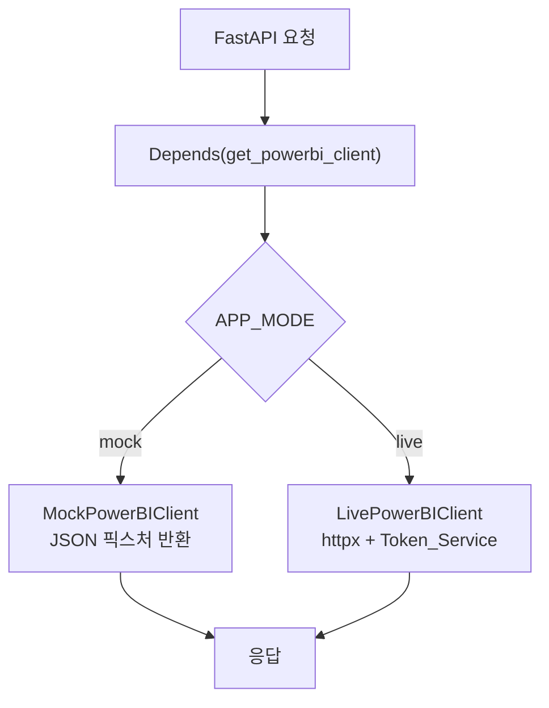
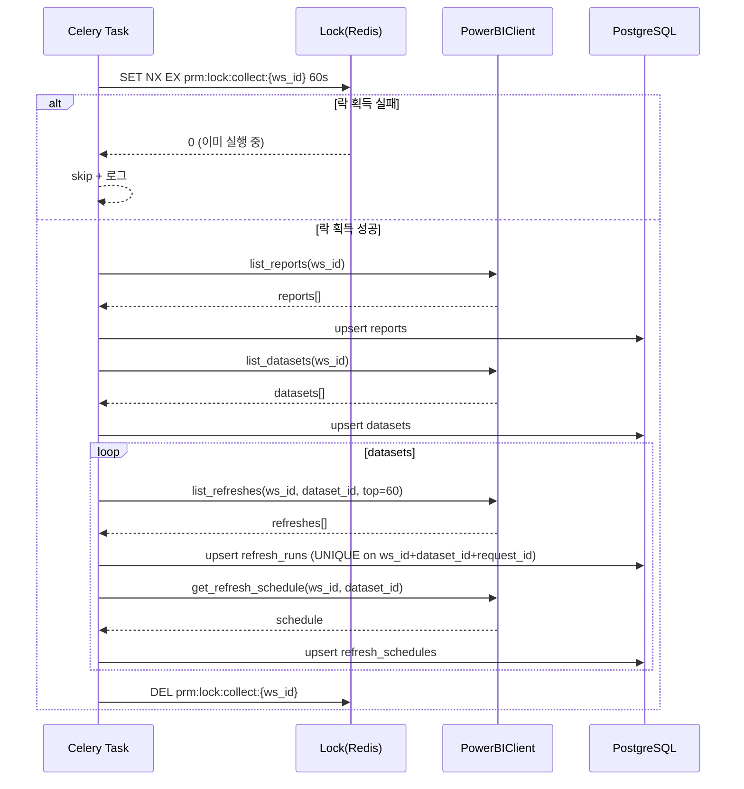
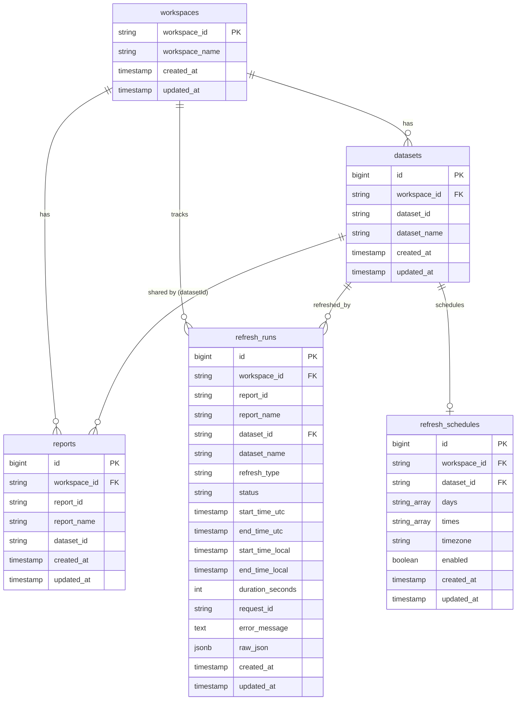
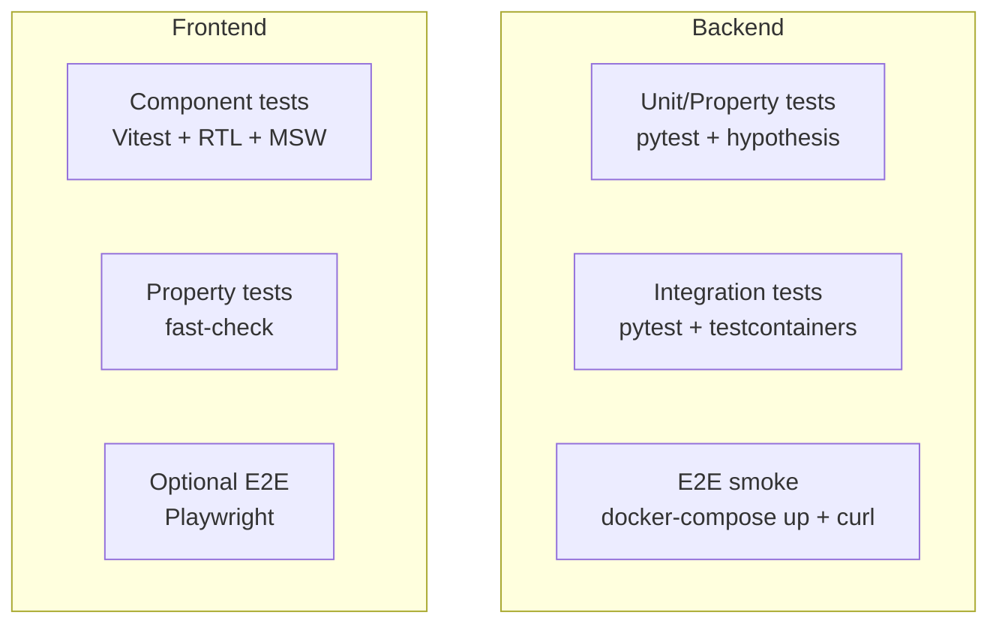
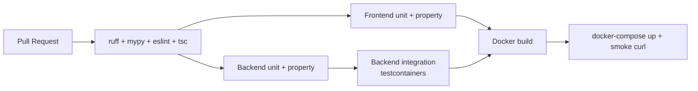

# Design Document

## Overview

Power BI Refresh Monitor (이하 PRM)는 Power BI Embedded Workspace의 Reports / Datasets / Refresh History / Refresh Schedule을 주기적으로 수집하여, 운영자가 한국어 웹 UI에서 Workspace 단위 새로고침 현황을 실시간으로 모니터링할 수 있게 하는 시스템이다.

본 설계는 다음 다섯 가지 핵심 결정에 기반한다.

1. **Mock_Mode / Live_Mode 분리** — 단일 환경 변수(`APP_MODE`)로 외부 Power BI API 호출 경로를 mock 구현체로 스위칭한다. 점진적 인도(Requirement 2)를 위한 가장 중요한 토글이며, FastAPI의 `Depends`와 팩토리 패턴으로 구현한다.
2. **Dataset 단위 데이터를 Report 단위 화면으로 노출** — Power BI REST API의 refresh history는 Dataset 단위이지만, 사용자가 인지하는 단위는 Report이다. 따라서 수집 시점에는 Dataset 단위로 정규화하여 적재하고, 조회 시점에 SQL JOIN으로 Report 단위로 펼친다(Requirement 6).
3. **이중 시간 컬럼** — Power BI는 UTC를 반환하나 운영자는 KST를 인지한다. 변환 비용과 표시 일관성을 위해 `start_time_utc/local`, `end_time_utc/local`을 모두 저장하고, 진행중 항목의 duration만 응답 시점에 동적 계산한다(Requirement 7).
4. **Worker / Scheduler는 Celery + Celery Beat로 결정** — 요구사항이 Celery 또는 RQ + APScheduler 둘 중 하나를 허용하나, (a) FastAPI 생태계에서 가장 검증된 분산 워커이며, (b) Celery Beat가 Scheduler를 자체 제공하여 컴포넌트 수가 줄고, (c) Redis brokerage를 그대로 재사용할 수 있어 본 설계에서는 **Celery + Celery Beat + Redis broker**를 채택한다.
5. **Frontend는 React 19 + Vite 6 + TanStack Query + Zustand** — 서버 상태(refresh 데이터)는 TanStack Query, 클라이언트 상태(필터/자동 새로고침 토글)는 Zustand로 분리한다. Gantt는 외부 라이브러리 부재 상황을 고려해 SVG 기반 자체 구현한다.

본 문서는 Overview → Architecture → Components and Interfaces → Data Models → Correctness Properties → Error Handling → Testing Strategy 순으로 기술한다. 마지막에 Requirements Traceability와 점진적 인도 단계 매핑을 추가한다.

## Architecture

### 시스템 컨텍스트 다이어그램

```mermaid
flowchart LR
    User[운영자<br/>브라우저]
    subgraph Docker["Docker Compose 네트워크"]
        FE[Frontend_App<br/>React 19 + Vite 6<br/>:5173]
        BE[Backend_API<br/>FastAPI<br/>:8000]
        WK[Collector_Worker<br/>Celery]
        SC[Scheduler<br/>Celery Beat]
        PG[(PostgreSQL 16)]
        RD[(Redis 7)]
    end
    AAD[Azure AD<br/>OAuth2 Token EP]
    PBI[Power BI REST API<br/>api.powerbi.com]

    User -->|HTTPS| FE
    FE -->|/api/*| BE
    BE -->|asyncpg| PG
    BE -->|aioredis| RD
    BE -->|enqueue| RD
    SC -->|beat schedule| RD
    WK -->|consume queue| RD
    WK -->|asyncpg| PG
    WK -->|aioredis token + lock| RD
    BE -.Live_Mode.->|httpx| PBI
    WK -.Live_Mode.->|httpx| PBI
    WK -.Live_Mode.->|client credentials| AAD
    BE -.Live_Mode.->|client credentials| AAD
```

### 런타임 모드 (Mock vs Live)

`APP_MODE` 환경 변수 한 개로 전체 Power BI 호출 경로를 결정한다.



- 동일 추상 인터페이스 `PowerBIClient` (Protocol)을 두고, `LivePowerBIClient`와 `MockPowerBIClient`가 이를 구현한다.
- Backend는 FastAPI `Depends(get_powerbi_client)`로 주입받고, Worker는 `Celery` 작업 시작 시 팩토리 함수로 가져온다.
- `APP_MODE=mock`일 때 `Token_Service`도 `MockTokenService`로 교체되어 Azure AD 호출이 절대 발생하지 않는다.
- 응답 스키마는 동일하므로 Frontend는 모드를 알 필요가 없다(Requirement 2.6: regression 방지).

### 점진적 인도 ↔ 모듈 매핑

| 단계 | 결과물 | 새로 생기는/변경되는 모듈 |
|---|---|---|
| 1. Mock UI | Mock data 기반 Frontend | `frontend/src/mocks/`, `pages/`, `components/`, `stores/`, `api/`, `types/` |
| 2. Backend mock endpoints | FastAPI 라우트 + Mock client | `backend/app/main.py`, `api/routes/*`, `services/powerbi/mock_client.py`, `schemas/`, `core/config.py` |
| 3. PostgreSQL + Alembic | DB 모델 + 마이그레이션 | `backend/app/db/`, `models/`, `migrations/` |
| 4. PowerBI_Client | 실제 API 호출 구현 | `services/powerbi/live_client.py`, `services/powerbi/token_service.py` |
| 5. POST /api/collect-now | 즉시 수집 라우트 | `api/routes/collect.py`, Celery enqueue 연결 |
| 6. Worker + Scheduler | Celery + Celery Beat | `backend/app/workers/`, `services/powerbi/collector.py`, `services/powerbi/lock.py` |
| 7. Frontend ↔ Backend 실연동 | mocks 제거 + 환경 변수 | `frontend/src/api/refreshApi.ts`, `.env` |
| 8. README 최종화 | 운영 문서 | `README.md`, `.env.example` |

## Components and Interfaces

### Backend 모듈 구조

```
backend/app/
├── main.py                 # FastAPI 앱 생성, 라우터 마운트, lifespan
├── core/
│   ├── config.py           # Pydantic Settings (env 바인딩)
│   ├── logging.py          # 구조화 로그 (JSON, request_id)
│   ├── timezone.py         # APP_TIMEZONE 변환 유틸
│   └── deps.py             # 공용 Depends (get_db, get_redis, get_powerbi_client)
├── db/
│   ├── base.py             # SQLAlchemy DeclarativeBase
│   ├── session.py          # async engine, async_sessionmaker
│   └── redis.py            # aioredis 클라이언트
├── migrations/             # Alembic env.py + versions/
├── models/
│   ├── workspace.py
│   ├── report.py
│   ├── dataset.py
│   ├── refresh_run.py
│   └── refresh_schedule.py
├── schemas/
│   ├── common.py           # 공통 응답/오류 스키마
│   ├── refresh.py          # RefreshRunOut, RefreshTimetableQuery, SummaryOut
│   ├── report.py
│   ├── dataset.py
│   └── schedule.py
├── services/
│   ├── powerbi/
│   │   ├── client.py       # PowerBIClient Protocol
│   │   ├── live_client.py  # httpx 기반 실 구현
│   │   ├── mock_client.py  # JSON 픽스처
│   │   ├── token_service.py# Azure AD client credentials + Redis 캐시
│   │   ├── status_mapper.py# Power BI status → 내부 enum 정규화
│   │   ├── error_parser.py # serviceExceptionJson 파싱
│   │   ├── collector.py    # Workspace 단위 수집 흐름
│   │   └── lock.py         # Redis 분산 락 (SET NX EX)
│   ├── refresh_query.py    # /api/refresh-* 조회 SQL
│   └── summary.py          # /api/summary 집계
├── api/routes/
│   ├── health.py
│   ├── reports.py
│   ├── datasets.py
│   ├── schedules.py
│   ├── refresh.py          # /api/refresh-history, /api/refresh-timetable
│   ├── summary.py
│   └── collect.py          # POST /api/collect-now
└── workers/
    ├── celery_app.py       # Celery 인스턴스, broker=Redis
    ├── beat_schedule.py    # Celery Beat 정의 (1분 또는 5분 간격)
    └── tasks/
        └── collect.py      # @app.task collect_workspace
```

### 주요 컴포넌트 책임

#### Token_Service (`services/powerbi/token_service.py`)

| 항목 | 내용 |
|---|---|
| 책임 | Azure AD client_credentials flow로 access token 발급/캐싱/무효화 |
| 의존성 | `httpx.AsyncClient`, `aioredis`, `Settings` |
| Redis 키 | `prm:powerbi:token:{tenant_id}:{client_id}` |
| TTL 정책 | `min(expires_in - 60, 3600)` 초 |
| 인터페이스 | `async def get_token() -> str`, `async def invalidate() -> None` |
| 401 처리 | `LivePowerBIClient`가 401 수신 시 `invalidate()` 후 1회 재시도 |
| 실패 처리 | Azure AD 4xx/5xx 시 `TokenServiceError(status_code, message)` 발생, **Redis 저장 안 함** |

#### PowerBIClient Protocol (`services/powerbi/client.py`)

```python
class PowerBIClient(Protocol):
    async def list_reports(self, workspace_id: str) -> list[ReportDTO]: ...
    async def list_datasets(self, workspace_id: str) -> list[DatasetDTO]: ...
    async def list_refreshes(self, workspace_id: str, dataset_id: str, top: int = 60) -> list[RefreshRunDTO]: ...
    async def get_refresh_schedule(self, workspace_id: str, dataset_id: str) -> RefreshScheduleDTO: ...
```

`LivePowerBIClient`는 다음 정책을 적용한다.

- **베이스 URL**: `POWERBI_API_BASE_URL` (기본 `https://api.powerbi.com/v1.0/myorg`)
- **타임아웃**: connect 5s, read 30s
- **인증**: `Authorization: Bearer {token}` (Token_Service에서 획득)
- **401 재시도**: `Token_Service.invalidate()` + 1회 재발급 + 1회 재시도 (총 2회)
- **429 재시도**: `Retry-After` 헤더(초)만큼 `asyncio.sleep` 후 1회 이상 재시도. 본 설계에서는 최대 3회 + 지수 backoff(2/4/8초, `Retry-After`가 더 크면 그것 사용).
- **로깅**: 모든 호출에 대해 `{url, method, status_code, elapsed_ms}` 구조화 로그 (Requirement 20.1).
- **시크릿 마스킹**: 헤더의 `Authorization`, body의 `client_secret`은 로그에서 `***`으로 치환 (Requirement 20.5).

`MockPowerBIClient`는 `backend/app/services/powerbi/fixtures/` 하위 JSON 파일을 읽어 동일 DTO를 반환한다. 픽스처는 다음을 포함한다.

- 5~10개 Report, 3~5개 Dataset (1개 Dataset이 여러 Report에 공유되는 케이스 포함)
- 각 Dataset당 30~60개 refresh history (성공/실패/진행중/Disabled 혼재)
- 시간은 "현재 시각 ± N분" 식으로 동적 계산하여 화면이 항상 최신처럼 보이게 함

#### Refresh_Collector (`services/powerbi/collector.py`)

Workspace 단위 1회 수집의 흐름은 다음과 같다.



- **Idempotency**: `refresh_runs`의 `(workspace_id, dataset_id, request_id)` UNIQUE 제약 + `INSERT ... ON CONFLICT DO UPDATE`로 보장 (Requirement 4.5).
- **진행중 갱신**: 이전 수집에서 `status='in_progress'`였던 row가 다음 수집에서 `status='success'`로 변경되면 `end_time_*`, `duration_seconds`, `error_message`도 함께 UPDATE (Requirement 4.6).
- **Reports/Datasets join**: 수집 시점에는 join하지 않는다. join은 조회 SQL에서 수행한다.

#### Refresh Query Service (`services/refresh_query.py`)

조회 시점의 Report ↔ Refresh History join SQL 골자:

```sql
SELECT
    rep.report_id,
    rep.report_name,
    ds.dataset_id,
    ds.dataset_name,
    rr.refresh_type,
    rr.status,
    rr.start_time_utc,
    rr.end_time_utc,
    rr.start_time_local,
    rr.end_time_local,
    COALESCE(
        rr.duration_seconds,
        EXTRACT(EPOCH FROM (NOW() AT TIME ZONE 'UTC' - rr.start_time_utc))::int
    ) AS duration_seconds,
    rr.request_id,
    rr.error_message
FROM reports rep
LEFT JOIN datasets ds ON ds.dataset_id = rep.dataset_id
LEFT JOIN refresh_runs rr
    ON rr.workspace_id = rep.workspace_id
   AND rr.dataset_id = rep.dataset_id
WHERE rep.workspace_id = :ws
  AND (:from IS NULL OR rr.start_time_local >= :from)
  AND (:to   IS NULL OR rr.start_time_local <= :to)
  AND (:status IS NULL OR rr.status = :status)
  AND (:report_id IS NULL OR rep.report_id = :report_id)
  AND (:dataset_id IS NULL OR ds.dataset_id = :dataset_id)
ORDER BY rr.start_time_utc DESC NULLS LAST;
```

- **Paginated report (datasetId NULL)**: LEFT JOIN 결과 `dataset_id`가 NULL이고 `rr.*`이 모두 NULL이면 application layer에서 `dataset_name = "데이터셋 없음"`로 채우고, `/api/refresh-timetable`에서는 해당 row를 결과에서 제외, `/api/reports`에서는 그대로 노출 (Requirement 6.3).
- **공유 Dataset**: 동일 Dataset을 사용하는 Report N개 × Refresh M개 → N×M row. UI에서는 리포트명 단위로 행을 그룹핑한다 (Requirement 6.2).
- **진행중 duration**: SQL 내 `COALESCE` + `EXTRACT(EPOCH ...)`로 계산 (Requirement 7.4).

### API 엔드포인트 명세

모든 응답은 JSON, UTF-8, 한국어 메시지 사용.

#### `GET /api/health`
- 응답 200: `{"status": "ok", "mode": "mock|live", "version": "1.0.0"}`

#### `GET /api/reports`
- 응답 200: 
```json
[{"reportId": "...", "reportName": "...", "datasetId": "..."|null, "datasetName": "..."|"데이터셋 없음"}]
```

#### `GET /api/datasets`
- 응답 200: `[{"datasetId": "...", "datasetName": "..."}]`

#### `GET /api/refresh-schedules`
- 응답 200:
```json
[{"datasetId": "...", "datasetName": "...", "days": ["Monday", "Tuesday"], 
  "times": ["07:00", "13:00"], "timezone": "Asia/Seoul", "enabled": true}]
```

#### `GET /api/refresh-history?date={YYYY-MM-DD}`
- 쿼리: `date` (필수, `APP_TIMEZONE` 기준 일자)
- 응답 200: `[RefreshRunOut, ...]`
- 응답 400: `{"errorCode": "INVALID_DATE", "errorDescription": "date는 YYYY-MM-DD 형식이어야 합니다."}`

#### `GET /api/refresh-timetable?from={ISO}&to={ISO}&status=...&reportId=...&datasetId=...`
- 쿼리: 모두 선택. `from`/`to`는 ISO 8601, `status` ∈ `success | failed | in_progress | unknown`
- 응답 200: `[RefreshRunOut, ...]`
- 응답 400: validation 실패

`RefreshRunOut` (Pydantic):

```python
class RefreshRunOut(BaseModel):
    reportId: str | None
    reportName: str
    datasetId: str | None
    datasetName: str
    refreshType: str | None
    status: Literal["success", "failed", "in_progress", "unknown"]
    startTimeUtc: datetime | None
    endTimeUtc: datetime | None
    startTimeLocal: datetime | None
    endTimeLocal: datetime | None
    durationSeconds: int | None
    requestId: str | None
    errorMessage: str | None
```

#### `GET /api/summary?date={YYYY-MM-DD}`
- 응답 200:
```json
{
  "total": 42, "success": 38, "failed": 3, "inProgress": 1,
  "averageDurationSeconds": 145,
  "longestRun": {"reportName": "매출 일일 보고", "durationSeconds": 612},
  "lastCompletedAtLocal": "2025-01-15T13:42:11+09:00"
}
```

#### `POST /api/collect-now`
- 요청 본문: 없음 (또는 `{"workspaceId": "..."}` 선택)
- 응답 202 (정상 enqueue): `{"status": "enqueued", "taskId": "celery-task-uuid"}`
- 응답 202 (이미 실행 중): `{"status": "already-running"}` (Requirement 10.2)

#### 공통 오류 응답

| 상황 | HTTP | Body |
|---|---|---|
| Validation 실패 | 400 | `{"errorCode": "VALIDATION_ERROR", "errorDescription": "..."}` |
| Power BI 인증/권한/rate limit 실패 | 502 | `{"errorCode": "POWERBI_ERROR", "errorDescription": "..."}` |
| 내부 서버 오류 | 500 | `{"errorCode": "INTERNAL_ERROR", "errorDescription": "..."}` |

### Power BI status 정규화 (`status_mapper.py`)

Power BI가 반환하는 status를 내부 enum으로 매핑한다.

| Power BI 값 | 내부 enum | 설명 |
|---|---|---|
| `Completed` | `success` | 정상 완료 |
| `Failed` | `failed` | 실패 |
| `Unknown` (endTime 없음) | `in_progress` | 진행중 |
| `Unknown` (endTime 있음) | `unknown` | 알 수 없음 |
| `Disabled` | `unknown` | Disabled |
| 그 외 | `unknown` | 방어적 기본값 |

### errorMessage 변환 (`error_parser.py`)

`serviceExceptionJson` 파싱 규칙:

```python
def parse_service_exception(raw: str | None) -> str | None:
    if not raw:
        return None
    try:
        obj = json.loads(raw)
        code = obj.get("errorCode") or obj.get("code") or ""
        desc = obj.get("errorDescription") or obj.get("message") or ""
        if code and desc:
            return f"[{code}] {desc}"
        return code or desc or raw[:500]
    except (json.JSONDecodeError, TypeError):
        return raw[:500]
```

- 성공: `[ModelRefreshFailed_CredentialsNotSpecified] Database credentials...`
- 파싱 실패: 원본 앞 500자 (Requirement 19.4).

### Frontend 아키텍처

#### 디렉터리 구조

```
frontend/src/
├── main.tsx                 # React 19 createRoot
├── App.tsx                  # Router + Layout
├── routes/
│   ├── DashboardPage.tsx
│   ├── RefreshStatusPage.tsx        # 메인 화면 (Gantt + KPI + Table)
│   ├── RefreshDetailPage.tsx
│   ├── RefreshLogPage.tsx
│   ├── analytics/
│   │   ├── ExecutionStatsPage.tsx
│   │   ├── DatasetThroughputPage.tsx
│   │   └── TopNPage.tsx
│   └── settings/
│       ├── ConnectionPage.tsx
│       ├── NotificationPage.tsx
│       └── UserPage.tsx
├── components/
│   ├── layout/
│   │   ├── Sidebar.tsx
│   │   └── Header.tsx
│   ├── filters/
│   │   └── FilterBar.tsx
│   ├── kpi/
│   │   └── KpiCards.tsx
│   ├── gantt/
│   │   ├── RefreshTimeline.tsx       # 메인 컨테이너
│   │   ├── GanttBar.tsx              # 개별 막대
│   │   ├── GanttAxis.tsx             # X/Y 축
│   │   └── NowLine.tsx               # 현재 시각 vertical line
│   ├── flow/
│   │   └── ExecutionFlow.tsx         # 우측 실행 흐름
│   ├── charts/
│   │   ├── DurationBarChart.tsx
│   │   ├── HourlyTrendChart.tsx
│   │   └── StatusDonutChart.tsx
│   ├── table/
│   │   └── RefreshTable.tsx
│   └── common/
│       ├── ErrorBanner.tsx           # Requirement 19.1
│       └── LoadingSpinner.tsx
├── stores/
│   └── useRefreshFilterStore.ts      # Zustand 클라이언트 상태
├── api/
│   ├── client.ts                     # axios/fetch 베이스
│   └── refreshApi.ts                 # 모든 /api/* 호출
├── types/
│   └── refresh.ts                    # Backend 응답 1:1 매핑
├── utils/
│   ├── date.ts                       # parse, format (date-fns)
│   ├── duration.ts                   # mm:ss / H시간 m분
│   └── csv.ts                        # UTF-8 BOM CSV
├── mocks/                            # 1단계 전용
│   └── fixtures.ts
└── i18n/
    └── ko.ts                         # 모든 한국어 라벨
```

#### 라우팅 ↔ 사이드바 매핑

| 사이드바 그룹 | 메뉴 | 경로 |
|---|---|---|
| 대시보드 | 대시보드 | `/` |
| 모니터링 | Refresh 실행 현황 | `/monitoring/status` (메인) |
| 모니터링 | Refresh 상세 조회 | `/monitoring/detail` |
| 모니터링 | Refresh 로그 | `/monitoring/log` |
| 분석 | 실행/실패 통계 | `/analytics/stats` |
| 분석 | 데이터셋별 처리량 | `/analytics/throughput` |
| 분석 | Top N 분석 | `/analytics/top-n` |
| 설정 | 연결 정보 | `/settings/connection` |
| 설정 | 알림 설정 | `/settings/notification` |
| 설정 | 사용자 관리 | `/settings/user` |

(Requirement 12.1: 4개 그룹, 각 메뉴는 한국어로 표기)

#### 상태 관리

**Zustand — `useRefreshFilterStore`** (클라이언트 상태)
```typescript
interface RefreshFilterState {
  from: Date;                 // 기본 오늘 00:00 KST
  to: Date;                   // 기본 오늘 23:59 KST
  workspaceId: string | null;
  reportId: string | null;
  datasetId: string | null;
  status: "all" | "success" | "failed" | "in_progress" | "unknown";
  autoRefresh: boolean;       // 기본 false
  autoRefreshIntervalSec: number; // 환경 변수에서 주입, 기본 60
  setRange(from: Date, to: Date): void;
  setStatus(s: ...): void;
  toggleAutoRefresh(): void;
  reset(): void;
}
```

**TanStack Query** (서버 상태)
- `useRefreshTimetable(filters)` → `GET /api/refresh-timetable`
- `useSummary(date)` → `GET /api/summary`
- `useReports()`, `useDatasets()`, `useSchedules()`
- 모든 query에 `refetchInterval: autoRefresh ? autoRefreshIntervalSec * 1000 : false` (Requirement 12.3, 14)

#### Refresh Timeline (Gantt) 컴포넌트 설계 결정

**선택**: Recharts가 아닌 **SVG 직접 구현**.

근거:
- Recharts는 `<ScatterChart>` + custom shape로 Gantt를 그릴 수 있으나, Y축 범주(리포트명)와 막대 hover 정밀 제어가 어렵다.
- 막대 수가 한 화면에 50~200개 수준으로 제한적이며, 단순 SVG `<rect>` + `<line>`으로 충분하다.
- "현재 시각 vertical line", "진행중 막대 동적 연장"은 SVG에서 간단하다.

**렌더링 모델**:
- `RefreshTimeline.tsx`: 컨테이너. props로 `runs: RefreshRunOut[]`, `from`, `to`. 
- 데이터 변환: 리포트명별로 그룹핑 → `{ rowIndex, run }` 평면화.
- X축: `from` ~ `to`를 px로 선형 매핑. 1시간 단위 그리드.
- Y축: 리포트명 (행 높이 28px).
- 막대 색상:
  - success → `#10b981` (emerald-500)
  - failed → `#ef4444` (red-500)
  - in_progress → `#f59e0b` (amber-500) + 사선 패턴
  - unknown → `#9ca3af` (gray-400)
- 진행중 막대: `endTimeLocal`이 null이면 현재 시각으로 right edge 그림 (Requirement 15.6).
- 현재 시각 line: `<line>` 1초 단위 갱신 X, 30초 단위로 충분.
- Tooltip: `<div role="tooltip">` 절대 배치, hover 시 표시 (Requirement 15.4).
- Duration 라벨: 막대 폭이 30px 이상이면 막대 안, 미만이면 막대 오른쪽에 표시 (Requirement 15.3).

#### 자동 새로고침

```typescript
const { autoRefresh, autoRefreshIntervalSec } = useRefreshFilterStore();
const { data } = useQuery({
  queryKey: ['refresh-timetable', filters],
  queryFn: () => refreshApi.getTimetable(filters),
  refetchInterval: autoRefresh ? autoRefreshIntervalSec * 1000 : false,
  staleTime: 10_000,
});
```

#### CSV 내보내기 (`utils/csv.ts`)

```typescript
export function downloadCSV(rows: RefreshRunOut[], filename: string) {
  const headers = ["순번","리포트명","데이터셋명","Refresh Type","상태",
                   "예약 시각","시작 시각","종료 시각","소요 시간","Request ID","오류 메시지"];
  const lines = [headers.join(",")];
  rows.forEach((r, i) => {
    lines.push([
      i + 1, esc(r.reportName), esc(r.datasetName), esc(r.refreshType ?? ""),
      esc(STATUS_KO[r.status]), esc(formatLocal(r.scheduledTimeLocal)),
      esc(formatLocal(r.startTimeLocal)), esc(formatLocal(r.endTimeLocal)),
      esc(formatDuration(r.durationSeconds)), esc(r.requestId ?? ""), esc(r.errorMessage ?? "")
    ].join(","));
  });
  const BOM = "\uFEFF";
  const blob = new Blob([BOM + lines.join("\n")], { type: "text/csv;charset=utf-8" });
  // ... a 태그로 다운로드
}
```

(Requirement 18.5: UTF-8 BOM 포함)

#### Frontend 오류 처리

- TanStack Query의 `error` 객체 구조화: `{status, errorCode, errorDescription}`.
- `<ErrorBanner>`: `error`가 있으면 화면 상단 sticky 영역에 빨간색 배너 + 재시도 버튼. 재시도 클릭 시 `query.refetch()`. (Requirement 19.1)
- 502 (Power BI 실패) 시 배너 메시지: `"Power BI 연결에 문제가 발생했습니다: {errorDescription}"`.

### Worker / Scheduler 설계

#### Celery + Celery Beat 채택 근거

| 항목 | Celery + Beat | RQ + APScheduler |
|---|---|---|
| Broker | Redis | Redis |
| Scheduler | Beat 내장 | 별도 프로세스 |
| 분산 워커 | ★ 검증된 분산 큐 | 단순하지만 분산 약함 |
| FastAPI 통합 | 풍부한 사례 | 사례 적음 |
| 모니터링 | Flower 연동 | 제한적 |

→ **Celery + Celery Beat** 채택. 동일한 Redis 인스턴스를 broker/result/lock 모두에 재사용.

#### 작업 정의

```python
# workers/tasks/collect.py
@celery_app.task(bind=True, name="prm.collect_workspace",
                 autoretry_for=(httpx.HTTPError,), retry_backoff=True, max_retries=3)
def collect_workspace(self, workspace_id: str) -> dict:
    return asyncio.run(_collect(workspace_id))
```

#### Beat schedule (`workers/beat_schedule.py`)

```python
beat_schedule = {
    "collect-every-N-minutes": {
        "task": "prm.collect_workspace",
        "schedule": crontab(minute=f"*/{COLLECT_INTERVAL_MINUTES}"),  # 1 또는 5
        "args": [POWERBI_WORKSPACE_ID],
    }
}
```

- `COLLECT_INTERVAL_MINUTES`는 `.env`로 주입, 허용값 `{1, 5}` (Requirement 4.7).

#### Redis 분산 락 (`services/powerbi/lock.py`)

```python
async def acquire_collect_lock(ws_id: str, ttl_sec: int = 60) -> str | None:
    """획득 시 lock_value(uuid) 반환, 실패 시 None"""
    key = f"prm:lock:collect:{ws_id}"
    val = str(uuid.uuid4())
    ok = await redis.set(key, val, nx=True, ex=ttl_sec)
    return val if ok else None

async def release_collect_lock(ws_id: str, lock_value: str) -> None:
    """동일 lock_value일 때만 DEL (Lua atomically)"""
    key = f"prm:lock:collect:{ws_id}"
    LUA = "if redis.call('get', KEYS[1]) == ARGV[1] then return redis.call('del', KEYS[1]) else return 0 end"
    await redis.eval(LUA, 1, key, lock_value)
```

- TTL은 Worker 1회 수집의 SLA(60초)와 동일 (Requirement 20.3). 작업이 길어져 TTL 만료 시 다른 worker가 진입 가능 — 단, idempotent upsert이므로 데이터 손상 없음.
- `POST /api/collect-now`도 동일 락 키를 검사해서 `already-running`을 결정 (Requirement 10.2).

### Redis 키/TTL 규약

| 용도 | 키 패턴 | TTL | 설명 |
|---|---|---|---|
| Power BI access token | `prm:powerbi:token:{tenant}:{client}` | `expires_in - 60` | 동시 worker 간 token 공유 |
| Refresh history 응답 캐시 | `prm:cache:refresh-timetable:{hash(query)}` | `CACHE_TTL_SECONDS` (기본 60) | 동일 필터 재요청 가속 |
| Refresh history 응답 캐시 (date 단위) | `prm:cache:refresh-history:{date}` | 60 | `/api/refresh-history` |
| Workspace 수집 락 | `prm:lock:collect:{workspace_id}` | 60 | 분산 락 |
| Celery broker | `celery` (Celery 기본) | — | 작업 큐 |
| Celery result backend | `celery-task-meta-*` (Celery 기본) | 24h | task_id 응답용 |

(Requirement 11)

## Data Models

### ERD



### 테이블 스펙

#### `workspaces`

| 컬럼 | 타입 | 제약 | 설명 |
|---|---|---|---|
| workspace_id | VARCHAR(64) | PK | Power BI groupId |
| workspace_name | VARCHAR(255) | NOT NULL | 표시용 이름 |
| created_at | TIMESTAMPTZ | NOT NULL DEFAULT now() | |
| updated_at | TIMESTAMPTZ | NOT NULL DEFAULT now() | |

#### `reports`

| 컬럼 | 타입 | 제약 | 설명 |
|---|---|---|---|
| id | BIGSERIAL | PK | |
| workspace_id | VARCHAR(64) | FK → workspaces, NOT NULL | |
| report_id | VARCHAR(64) | NOT NULL | Power BI reportId |
| report_name | VARCHAR(500) | NOT NULL | |
| dataset_id | VARCHAR(64) | NULL 허용 | paginated report은 NULL |
| created_at | TIMESTAMPTZ | NOT NULL DEFAULT now() | |
| updated_at | TIMESTAMPTZ | NOT NULL DEFAULT now() | |

- UNIQUE: `(workspace_id, report_id)`
- INDEX: `idx_reports_dataset (workspace_id, dataset_id)` — JOIN 최적화

#### `datasets`

| 컬럼 | 타입 | 제약 | 설명 |
|---|---|---|---|
| id | BIGSERIAL | PK | |
| workspace_id | VARCHAR(64) | FK, NOT NULL | |
| dataset_id | VARCHAR(64) | NOT NULL | |
| dataset_name | VARCHAR(500) | NOT NULL | |
| created_at | TIMESTAMPTZ | NOT NULL DEFAULT now() | |
| updated_at | TIMESTAMPTZ | NOT NULL DEFAULT now() | |

- UNIQUE: `(workspace_id, dataset_id)`

#### `refresh_runs`

| 컬럼 | 타입 | 제약 | 설명 |
|---|---|---|---|
| id | BIGSERIAL | PK | |
| workspace_id | VARCHAR(64) | NOT NULL | |
| report_id | VARCHAR(64) | NULL 허용 | Power BI는 reportId를 직접 주지 않음 — JOIN 보조용 |
| report_name | VARCHAR(500) | NULL 허용 | denormalize (편의) |
| dataset_id | VARCHAR(64) | NOT NULL | |
| dataset_name | VARCHAR(500) | NULL 허용 | denormalize (편의) |
| refresh_type | VARCHAR(64) | NULL 허용 | Scheduled / OnDemand / ViaApi |
| status | VARCHAR(32) | NOT NULL CHECK in (success/failed/in_progress/unknown) | 정규화된 enum |
| start_time_utc | TIMESTAMPTZ | NOT NULL | |
| end_time_utc | TIMESTAMPTZ | NULL 허용 | 진행중이면 NULL |
| start_time_local | TIMESTAMPTZ | NOT NULL | APP_TIMEZONE 변환 |
| end_time_local | TIMESTAMPTZ | NULL 허용 | |
| duration_seconds | INTEGER | NULL 허용 | end_time_utc 있을 때만 |
| request_id | VARCHAR(128) | NOT NULL | |
| error_message | TEXT | NULL 허용 | serviceExceptionJson 변환본 |
| raw_json | JSONB | NOT NULL | Power BI 원본 (Requirement 4.10) |
| created_at | TIMESTAMPTZ | NOT NULL DEFAULT now() | |
| updated_at | TIMESTAMPTZ | NOT NULL DEFAULT now() | |

**제약**:
- UNIQUE: `(workspace_id, dataset_id, request_id)` — Requirement 5.4
- INDEX: `idx_runs_ws_start (workspace_id, start_time_utc DESC)` — 일자/기간 조회 최적화
- INDEX: `idx_runs_status (status)` — 상태 필터
- INDEX: `idx_runs_dataset (workspace_id, dataset_id, start_time_utc DESC)` — Dataset 단위 조회

#### `refresh_schedules`

| 컬럼 | 타입 | 제약 | 설명 |
|---|---|---|---|
| id | BIGSERIAL | PK | |
| workspace_id | VARCHAR(64) | NOT NULL | |
| dataset_id | VARCHAR(64) | NOT NULL | |
| days | VARCHAR(16)[] | NOT NULL DEFAULT '{}' | ["Monday", ...] |
| times | VARCHAR(8)[] | NOT NULL DEFAULT '{}' | ["07:00", "13:00"] |
| timezone | VARCHAR(64) | NOT NULL | "Asia/Seoul" |
| enabled | BOOLEAN | NOT NULL DEFAULT true | |
| created_at | TIMESTAMPTZ | NOT NULL DEFAULT now() | |
| updated_at | TIMESTAMPTZ | NOT NULL DEFAULT now() | |

- UNIQUE: `(workspace_id, dataset_id)`

### Alembic 마이그레이션 정책

- 모든 스키마 변경은 `backend/app/migrations/versions/` 하위 파일로 관리 (Requirement 5.5).
- 컨테이너 entrypoint 스크립트(`backend/entrypoint.sh`)에서 `alembic upgrade head`를 실행 후 `uvicorn`을 기동 (Requirement 5.6).
- Worker / Scheduler 컨테이너는 마이그레이션을 실행하지 않고 Backend가 끝나기를 기다린다 (Compose `depends_on` + healthcheck).

### Docker Compose 구성

```yaml
services:
  postgres:
    image: postgres:16
    healthcheck: { test: ["CMD-SHELL", "pg_isready -U $$POSTGRES_USER"], interval: 5s }
    volumes: [postgres-data:/var/lib/postgresql/data]
  redis:
    image: redis:7-alpine
    healthcheck: { test: ["CMD", "redis-cli", "ping"], interval: 5s }
  backend:
    build: ./backend
    depends_on: { postgres: {condition: service_healthy}, redis: {condition: service_healthy} }
    entrypoint: ["./entrypoint.sh"]   # alembic upgrade head + uvicorn
    ports: ["8000:8000"]
    healthcheck: { test: ["CMD", "curl", "-f", "http://localhost:8000/api/health"] }
  worker:
    build: ./backend
    command: celery -A app.workers.celery_app worker --loglevel=info
    depends_on: { backend: {condition: service_healthy}, redis: {condition: service_healthy} }
  scheduler:
    build: ./backend
    command: celery -A app.workers.celery_app beat --loglevel=info
    depends_on: { worker: {condition: service_started}, redis: {condition: service_healthy} }
  frontend:
    build: ./frontend
    depends_on: [backend]
    ports: ["5173:80"]
volumes:
  postgres-data:
networks:
  default: { name: prm-net }
```

(Requirement 1.1, 5.6)


## Correctness Properties

*Property는 시스템의 모든 유효한 실행에 걸쳐 참이어야 하는 성질이다 — 사람이 읽는 명세와 기계가 검증하는 정확성 보증을 잇는 형식적 진술이다. 본 절의 각 Property는 무한한 입력 공간에 대한 보편적 양화(universal quantification)로 기술되며, 후속 단계에서 hypothesis(Backend) 및 fast-check(Frontend)로 자동 검증된다.*

본 시스템은 (a) Power BI 데이터 정규화/변환 로직, (b) 시간대 변환, (c) 분산 락 / 캐시, (d) 모드 추상화의 동치성 등 **순수 함수와 invariant 중심**의 면이 명확하므로 PBT 적용 가치가 높다. 반면 Docker Compose 구성, 정적 라벨, 사이드바 메뉴 같은 **정적 콘텐츠**는 example 기반 테스트로 충분하며 본 절에서 제외한다.

prework 분석 결과 redundancy를 제거한 최종 8개 property는 다음과 같다.

### Property 1: Refresh_Run upsert 멱등성 및 선택적 갱신

*For any* `RefreshRunDTO` 시퀀스 `r1, r2, ..., rN`이 동일한 `(workspace_id, dataset_id, request_id)` 키를 공유하는 경우, 시퀀스를 순차적으로 collector에 적용한 후 `refresh_runs` 테이블의 해당 키 row 수는 정확히 1이며, 그 row의 모든 컬럼 값은 시퀀스 마지막 항목 `rN`의 매핑 결과와 동등하다. 또한 `r1.status = 'in_progress'` 이고 `r2.status = 'success'`이며 `r2`에 `report_name`이 누락된 경우, 갱신 후 row의 `report_name`은 `r1`의 값을 보존한다.

**Validates: Requirements 4.5, 4.6, 5.4, 11.3**

### Property 2: Refresh duration 계산 일관성

*For any* `(start_time_utc, end_time_utc)` 쌍에 대해, `end_time_utc IS NOT NULL`이면 응답의 `durationSeconds`는 `(end_time_utc - start_time_utc).total_seconds()`의 정수 변환과 동등하고 항상 0 이상이다. `end_time_utc IS NULL`(진행중)이면 응답의 `durationSeconds`는 `(현재 UTC 시각 - start_time_utc).total_seconds()`와 1초 이내 오차로 동등하다.

**Validates: Requirements 7.1, 7.3, 7.4**

### Property 3: UTC ↔ APP_TIMEZONE round-trip 등가성

*For any* tz-aware UTC `datetime` `t`에 대해, `to_local(t)`는 `t`와 동일한 절대 순간을 가리키고 `to_utc(to_local(t)) == t`가 성립한다. 또한 동일 row의 `start_time_utc`와 `start_time_local`은 항상 동일한 absolute 순간을 표현한다 (`start_time_local.astimezone(UTC) == start_time_utc`).

**Validates: Requirements 7.1, 7.2, 7.5**

### Property 4: serviceExceptionJson 파서의 total function 보장

*For any* 입력 문자열 `s` (None, 빈 문자열, 비-JSON 임의 문자열, 부분 JSON, 정상 JSON 모두 포함)에 대해, `parse_service_exception(s)`는 예외를 던지지 않고 항상 `str | None`을 반환하며, 반환 문자열의 길이는 항상 500 이하이다. 또한 `s`가 `errorCode`, `errorDescription` 키를 모두 포함하는 valid JSON이면 반환 문자열은 그 두 값의 부분 문자열을 모두 포함한다.

**Validates: Requirements 9.4, 19.3, 19.4**

### Property 5: Reports ↔ Refresh History fan-out consistency

*For any* 동일 `dataset_id`를 공유하는 Report 집합 `{R1, ..., Rn}`과 그 Dataset의 Refresh_Run 집합 `S`에 대해, `/api/refresh-timetable` 응답을 `report_id`별로 그룹핑한 결과 `Group(Ri)`는 모든 `i`에서 동일한 `request_id` 집합을 포함한다. 즉 `{run.requestId for run in Group(Ri)}` = `{r.request_id for r in S}` (필터 적용 전 기준).

**Validates: Requirements 6.1, 6.2**

### Property 6: Mock_Mode와 Live_Mode 응답 스키마 동치성

*For any* `/api/refresh-history`, `/api/refresh-timetable`, `/api/reports`, `/api/datasets`, `/api/refresh-schedules`, `/api/summary` 엔드포인트와 임의의 (유효한) 쿼리 파라미터에 대해, `APP_MODE=mock`으로 호출한 응답과 `APP_MODE=live`(stubbed httpx)로 호출한 응답은 모두 동일한 Pydantic 스키마(`RefreshRunOut`, `SummaryOut` 등)에 대해 validation을 통과한다. 즉 모드 전환은 외부 인터페이스의 회귀를 발생시키지 않는다.

**Validates: Requirements 2.2, 2.4, 2.6**

### Property 7: Refresh timetable 필터 술어 만족

*For any* 쿼리 파라미터 조합 `(from, to, status, reportId, datasetId)`에 대해, `/api/refresh-timetable` 응답의 모든 row `r`은 다음 술어를 동시에 만족한다.

- `from is None or r.startTimeLocal >= from`
- `to is None or r.startTimeLocal <= to`
- `status is None or r.status == status`
- `reportId is None or r.reportId == reportId`
- `datasetId is None or r.datasetId == datasetId`

또한 `/api/refresh-history?date=D` 응답의 모든 row는 `r.startTimeLocal.date() == D`를 만족한다.

**Validates: Requirements 9.1, 9.2**

### Property 8: 분산 락의 상호 배제 (mutual exclusion)

*For any* 동시 호출 수 `N >= 2`에 대해, 동일 `workspace_id` 키로 `acquire_collect_lock`을 `asyncio.gather`로 N회 동시에 호출했을 때, 정확히 1개의 호출만이 non-None lock value를 반환하고, 나머지 `N-1`개는 None을 반환한다. 또한 lock value를 보유하지 않은 caller가 `release_collect_lock`을 호출해도 lock은 해제되지 않는다 (Lua atomically 보장).

**Validates: Requirements 4.8, 11.3**

## Error Handling

### Backend 오류 분류와 응답

| 오류 카테고리 | 발생 위치 | HTTP | errorCode | 추가 동작 |
|---|---|---|---|---|
| 입력 유효성 (date/ISO 형식 등) | FastAPI 검증 | 400 | `VALIDATION_ERROR` | Pydantic 메시지 한국어화 |
| Power BI 인증 실패 (Azure AD 4xx) | Token_Service | 502 | `POWERBI_AUTH_ERROR` | 캐시 저장 안 함, 재시도 안 함 |
| Power BI 인가 실패 (403) | LivePowerBIClient | 502 | `POWERBI_FORBIDDEN` | — |
| Power BI rate limit (429) | LivePowerBIClient | 502 (retry 후에도 실패 시) | `POWERBI_RATE_LIMIT` | Retry-After 대기 후 최대 3회 재시도 |
| Power BI 5xx | LivePowerBIClient | 502 | `POWERBI_UPSTREAM_5XX` | 지수 backoff 2/4/8초 |
| Power BI 401 | LivePowerBIClient | (정상화) | — | token 무효화 + 1회 재시도, 그래도 실패 시 502 `POWERBI_AUTH_ERROR` |
| DB 무결성 위반 | SQLAlchemy | 500 | `DB_INTEGRITY_ERROR` | 로그에만 자세히 |
| 작업 큐 enqueue 실패 | Celery | 503 | `QUEUE_UNAVAILABLE` | — |
| 예상치 못한 예외 | 전역 핸들러 | 500 | `INTERNAL_ERROR` | 사용자에게는 일반 메시지, 로그에는 traceback |

응답 표준 형식:

```json
{
  "errorCode": "POWERBI_AUTH_ERROR",
  "errorDescription": "Power BI 토큰 발급에 실패했습니다.",
  "details": { "upstreamStatus": 401 }
}
```

### Backend 로깅 정책

`structlog` 기반 JSON 로그를 stdout으로 출력. 모든 record에 다음 공통 필드 포함.

- `timestamp` (ISO 8601 UTC)
- `level` (`info|warning|error`)
- `logger` (모듈명)
- `request_id` (UUID — 미들웨어가 모든 요청에 부여, 응답 헤더 `X-Request-Id`로도 노출)
- `event` (사람 읽는 메시지)

**Power BI 호출 측정 record**:
```json
{
  "event": "powerbi_request",
  "method": "GET",
  "url": "https://api.powerbi.com/v1.0/myorg/groups/{ws}/datasets/{ds}/refreshes",
  "status_code": 200,
  "elapsed_ms": 312,
  "retry_count": 0
}
```

URL의 `client_secret`, `Authorization` 헤더 값은 미들웨어/포매터에서 `***`로 마스킹한다. 응답 본문은 로그에 기본적으로 포함하지 않으며, 디버그 모드에서만 길이 제한(2KB)으로 기록한다.

### Frontend 오류 처리

- TanStack Query의 `error` 객체를 axios interceptor에서 표준화하여 `{status, errorCode, errorDescription}` 형태로 노출.
- 상위 `<App>`에 `<ErrorBanner>`를 sticky 배치. 5xx 또는 네트워크 오류 시 빨간 배경 + 재시도 버튼 (Requirement 19.1).
- Mutation(`POST /api/collect-now`) 실패 시 toast 알림.
- 401(미인증)은 본 단계에서는 발생하지 않음(인증 미적용). 향후 RBAC 도입 시 `/login` 리다이렉트 인터셉터를 추가.

### serviceExceptionJson → errorMessage 변환

(Components and Interfaces 절 참조). 예시 입출력:

| 입력 | 출력 |
|---|---|
| `null` 또는 `""` | `None` |
| `'{"errorCode":"X","errorDescription":"Y"}'` | `"[X] Y"` |
| `'{"code":"X"}'` | `"X"` |
| `'plain non-json text...'` (≤500자) | 원문 |
| `'plain non-json text...'` (>500자) | 앞 500자 |
| 깊이 100 중첩 dict | `[code] desc` 또는 빈 값 fallback |

Property 4가 보장하는 것: **어떤 입력에도 예외 없이 항상 str 또는 None 반환, 길이 ≤ 500.**

## Testing Strategy

### 테스트 피라미드



### Backend 테스트

**도구**:
- `pytest` + `pytest-asyncio`: 비동기 SQLAlchemy/httpx 테스트
- `httpx.ASGITransport`: FastAPI 앱을 in-process로 호출
- `respx`: httpx 외부 호출 mock
- `hypothesis`: 속성 기반 테스트
- `testcontainers-python`: PostgreSQL 16, Redis 7 컨테이너 (CI용)
- 로컬 개발 시에는 `docker-compose.test.yml`로 동일 서비스 기동

**파일 배치**:
```
backend/tests/
├── conftest.py                # 공용 fixture (db_session, redis, app, client)
├── unit/
│   ├── test_status_mapper.py
│   ├── test_error_parser.py   # Property 4
│   ├── test_timezone.py       # Property 3
│   └── test_csv.py
├── integration/
│   ├── test_health.py
│   ├── test_reports_api.py
│   ├── test_refresh_api.py    # Property 7
│   ├── test_summary_api.py
│   ├── test_collect_api.py
│   └── test_mode_parity.py    # Property 6
└── property/
    ├── test_upsert_idempotency.py    # Property 1
    ├── test_duration.py              # Property 2
    ├── test_timezone_roundtrip.py    # Property 3
    ├── test_error_parser_total.py    # Property 4
    ├── test_fanout_consistency.py    # Property 5
    ├── test_mode_schema_parity.py    # Property 6
    ├── test_filter_predicates.py     # Property 7
    └── test_distributed_lock.py      # Property 8
```

**Property 테스트 정책**:
- 모든 property 테스트는 hypothesis `@given`을 사용하며 `settings(max_examples=200, deadline=timedelta(seconds=5))`로 최소 100회 이상 실행을 보장.
- 각 테스트의 docstring에 `Feature: powerbi-refresh-monitor, Property {N}: {짧은 진술}` 태그를 포함.
- 시간 의존 property는 `freezegun` 또는 hypothesis의 `datetimes()` strategy로 결정성 확보.
- DB property 테스트는 트랜잭션 fixture(`SAVEPOINT` rollback)로 데이터 격리.

예시 (Property 1):

```python
# Feature: powerbi-refresh-monitor, Property 1: Refresh_Run upsert 멱등성
@given(runs=lists(refresh_run_dto_strategy(same_request_id=True), min_size=1, max_size=5))
@settings(max_examples=200, deadline=None)
async def test_upsert_idempotent(db_session, runs):
    for r in runs:
        await collector.upsert_refresh_run(db_session, r)
    rows = await db_session.execute(
        select(RefreshRun).where(RefreshRun.request_id == runs[0].request_id)
    )
    rows = rows.scalars().all()
    assert len(rows) == 1
    last = rows[0]
    expected = collector.dto_to_row(runs[-1])
    # status, end_time, duration은 마지막 값
    assert last.status == expected.status
    assert last.end_time_utc == expected.end_time_utc
    # 누락된 필드(예: report_name=None인 마지막 DTO)는 보존됨
    if runs[-1].report_name is None:
        # 마지막 이전 적재 중 가장 최근 non-null report_name 보존
        non_null = [r.report_name for r in runs if r.report_name is not None]
        if non_null:
            assert last.report_name == non_null[-1]
```

**Integration 테스트**: `httpx.AsyncClient(transport=ASGITransport(app=app))` + 실제 PostgreSQL/Redis로 endpoint를 검증. `/api/health`, `/api/reports`, `/api/refresh-history`, `/api/summary`, `/api/collect-now` 각각 happy path + 한 가지 오류 path.

**Mock/Live 동치성**: `test_mode_parity.py`에서 동일 fixture 데이터를 mock client에 주입하고, 동일 응답을 stubbed httpx로 live client에 흘려보내 두 응답을 dict로 동등성 비교(Property 6).

### Frontend 테스트

**도구**:
- `vitest`: 테스트 러너
- `@testing-library/react`: 컴포넌트 렌더 + 사용자 인터랙션
- `msw` (Mock Service Worker): API mocking
- `fast-check`: TS property-based testing

**파일 배치**:
```
frontend/src/__tests__/
├── components/
│   ├── Sidebar.test.tsx
│   ├── KpiCards.test.tsx
│   ├── RefreshTable.test.tsx       # 검색/정렬 PROPERTY (fast-check)
│   ├── RefreshTimeline.test.tsx
│   └── ErrorBanner.test.tsx
├── stores/
│   └── useRefreshFilterStore.test.ts
├── api/
│   └── refreshApi.test.ts
├── property/
│   ├── csv.property.test.ts        # Property: BOM + row count
│   ├── search.property.test.ts     # Property: includes invariant
│   └── duration.property.test.ts   # Property: format(d) ≤ "H시간 m분"
└── pages/
    └── RefreshStatusPage.test.tsx  # MSW 통합
```

**fast-check 예시** (CSV BOM):

```typescript
import { fc } from "fast-check";
import { downloadCSV } from "@/utils/csv";

// Feature: powerbi-refresh-monitor, Property: CSV는 항상 UTF-8 BOM으로 시작
test("CSV always starts with UTF-8 BOM", () => {
  fc.assert(
    fc.property(fc.array(refreshRunOutArbitrary, { maxLength: 50 }), (rows) => {
      const blob = downloadCSV(rows, "test.csv");
      const text = blob.text(); // (sync helper in test)
      expect(text.charCodeAt(0)).toBe(0xfeff);
      expect(text.split("\n").length).toBe(rows.length + 1); // header + rows
    }),
    { numRuns: 200 }
  );
});
```

### Performance & Smoke 테스트 (Requirement 20.2, 20.3)

- 응답 시간 SLA(200ms 캐시 hit / 1000ms 캐시 miss)는 단위 테스트가 아닌 **로컬 docker-compose 환경에서의 단일 측정 스크립트**(`backend/scripts/perf_check.py`)로 검증한다.
- Worker 60초 SLA는 통합 환경에서 fixture 50개 dataset 적재 후 `time celery call`로 측정.

### CI 파이프라인 (참고)



### 테스트 커버리지 목표

- Backend: line ≥ 80%, services/powerbi 모듈 ≥ 90%
- Frontend: 핵심 컴포넌트(Gantt, Table, FilterBar) ≥ 85%

## 보안 고려사항

| 항목 | 정책 |
|---|---|
| 시크릿 환경 변수 | `.env`는 git에 커밋 금지, `.env.example`만 커밋. 운영은 secret manager 권장. |
| 로그 마스킹 | structlog processor에서 `Authorization`, `client_secret`, `password` 키를 `***`로 치환. |
| 응답 sanitize | 오류 응답에 stack trace, secret, 내부 SQL을 절대 포함하지 않음. |
| CORS | dev: `http://localhost:5173` 허용. 운영: `CORS_ALLOWED_ORIGINS` 환경 변수로 명시적 list. |
| 인증/권한 | 본 단계: 헤더의 `admin` 표시(정적). 향후: Azure AD SSO + 역할 기반 라우트 가드. |
| Token 노출 방지 | Redis 키는 internal network에서만 접근. Backend는 token을 응답으로 반환하지 않음. |
| TLS | 운영 배포 시 reverse proxy(nginx/traefik)에서 TLS 종단. Backend는 HTTP. |

(Requirement 20.5)

## 확장성 고려

- **다중 Workspace**: 모든 테이블에 `workspace_id` 컬럼이 이미 존재. `POWERBI_WORKSPACE_ID`를 list로 확장하고 Beat schedule에서 fan-out하면 멀티 Workspace 지원 가능.
- **페이지네이션**: 현재 화면은 60개 refresh × 적은 dataset 수를 가정. Refresh 이력이 누적되면 `/api/refresh-timetable`에 `limit/offset` 또는 cursor(`?cursor=...`)를 추가. 본 설계의 응답 스키마는 변경 없이 envelope `{ data: [...], nextCursor: "..." }`로 진화 가능.
- **Worker 수평 확장**: Celery worker 수를 늘리고, 락 키가 workspace 단위이므로 여러 workspace는 병렬 수집 가능.
- **Power BI capacity API**: 향후 capacity utilization 메트릭을 동일 collector에 추가 가능 (별도 task로).

## Phased Delivery 매핑

| 단계 | 산출 컴포넌트 | 검증 기준 |
|---|---|---|
| 1. Mock UI | Frontend 라우트/컴포넌트/Zustand store + 정적 fixture | `npm run dev`로 모든 화면 렌더 |
| 2. Backend mock endpoints | FastAPI app + `MockPowerBIClient` + Pydantic schemas | `/api/health` 200, 모든 GET 라우트 mock 응답 |
| 3. PostgreSQL + Alembic | 5개 테이블, Alembic migration | `alembic upgrade head` 성공 + ERD 일치 |
| 4. PowerBI_Client (Live) | `LivePowerBIClient` + `Token_Service` + Property 6 통과 | 실제 자격 증명으로 `/api/reports` 200 |
| 5. POST /api/collect-now | enqueue endpoint + lock 확인 | 호출 시 Celery task_id 반환, 중복 시 already-running |
| 6. Worker + Scheduler | Celery + Celery Beat | 1분/5분 간격으로 DB row 증가 |
| 7. Frontend ↔ Backend 실연동 | mocks 제거, 환경 변수 base URL | E2E smoke로 모든 화면이 실 데이터 표시 |
| 8. README 최종화 | 운영 문서 + .env.example | 새 개발자가 README만으로 30분 내 기동 |

(Requirement 2.5)

## Requirements Traceability

| 요구사항 | 충족하는 설계 절 |
|---|---|
| R1.1~1.8 (스택/구조) | Architecture, Components and Interfaces (디렉터리 구조), Docker Compose 구성 |
| R2.1~2.6 (Mock/Live) | Architecture (런타임 모드), Components (`PowerBIClient` Protocol), Property 6, Phased Delivery |
| R3.1~3.5 (인증) | Token_Service, Error Handling, Property (3.2 EXAMPLE) |
| R4.1~4.10 (수집) | Refresh_Collector, Property 1, Property 8, Redis lock |
| R5.1~5.6 (영속화) | Data Models, Alembic 정책 |
| R6.1~6.3 (Reports↔Refresh) | Refresh Query Service (JOIN SQL), Property 5 |
| R7.1~7.5 (시간) | Components (이중 시간 컬럼), Property 2, Property 3 |
| R8.1~8.4 (메타 API) | API 엔드포인트 명세 |
| R9.1~9.6 (Refresh API) | API 엔드포인트 명세, Property 7, Error Handling (400) |
| R10.1~10.3 (collect-now) | API 엔드포인트, Lock 정책 |
| R11.1~11.3 (Redis) | Redis 키/TTL 규약, Property 8 |
| R12.1~12.4 (사이드바/헤더) | Frontend 디렉터리 구조, 라우팅 매핑, 자동 새로고침 |
| R13.1~13.4 (필터) | Frontend 상태 관리 (`useRefreshFilterStore`) |
| R14.1~14.3 (KPI) | `KpiCards`, `useSummary` |
| R15.1~15.6 (Gantt) | RefreshTimeline 설계 결정 |
| R16.1~16.2 (실행 흐름) | `ExecutionFlow` 컴포넌트 |
| R17.1~17.2 (분석 차트) | `charts/*` 컴포넌트 |
| R18.1~18.5 (테이블) | `RefreshTable`, `utils/csv.ts`, Property (CSV) |
| R19.1~19.4 (오류) | Error Handling, Property 4 |
| R20.1~20.5 (비기능) | 보안 고려사항, 로깅 정책, Performance 테스트 |
